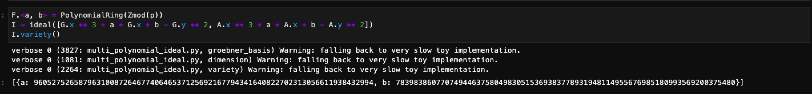
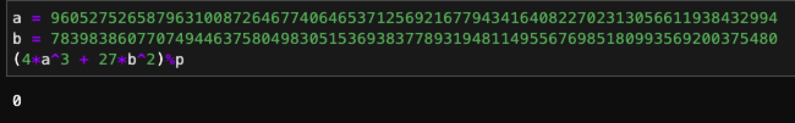
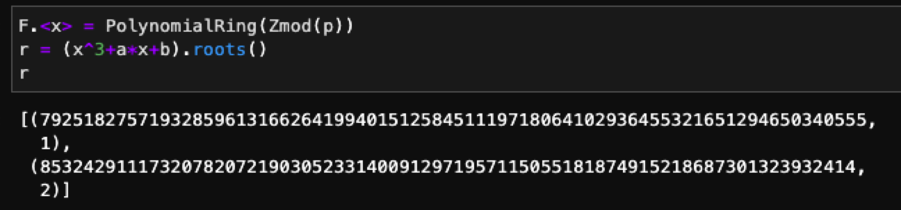
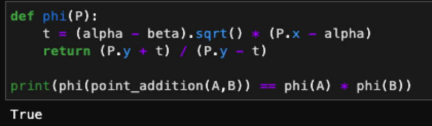
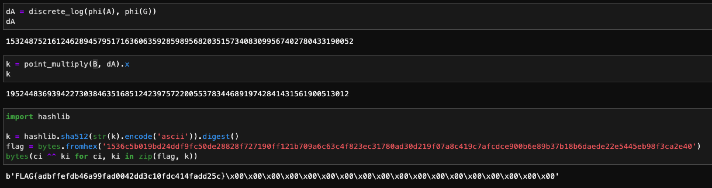

# Single

首先需要先解出橢圓曲線的係數 a, b，可以直接拿任意兩個點代入方程式即可解出：

有了 a, b 後確認一下 $4*a^3 + 27*b^2 = 0 \ (mod \ p)$ 確定這個曲線是 singular curve：

接著就可以解出兩個根 alpha, beta：

定義上課提到的 phi function，並驗證是否有 homomorphism：

透過 `discrete_log` 解出 dA 後，然後就可以拿到 key，接著再對密文做解密即可取得 flag：

