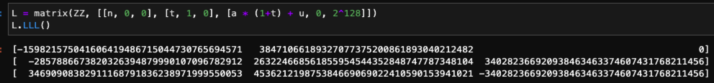
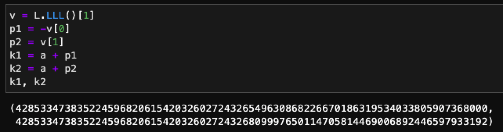
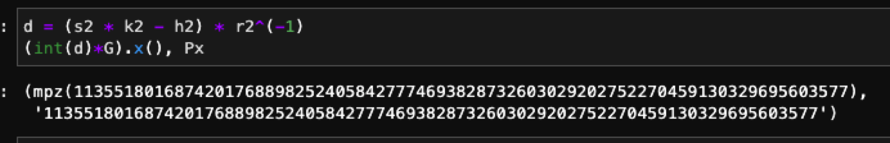
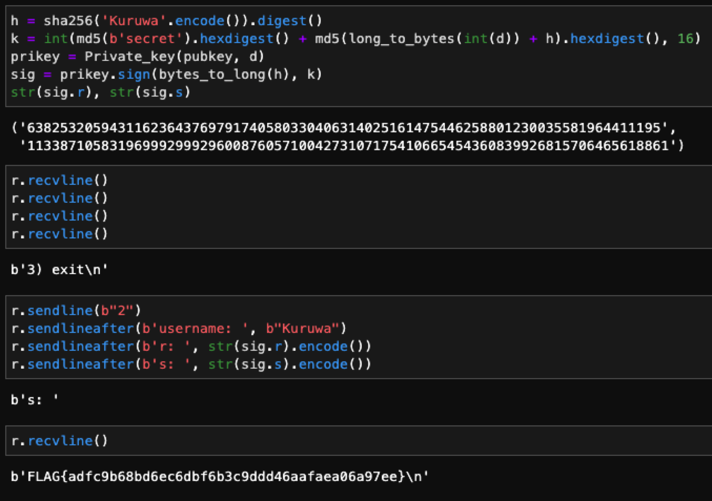

# HNP-revenge

先向 server 拿兩個 message 的 signature，接著解方程式，想要求出 k1 及 k2：

$s_1 k_1 - h_1 = d * r_1$ and $s_2 k_2 - h_2 = d * r_2$

$(s_1 k_1 - h_1) / (s_2 k_2 - h_2) = r_1/r_2$

$\to (s_1 k_1 - h_1) *r_2 = (s_2 k_2 - h_2) * r_1$

$\to s_1 k_1 r_2 - h_1 r_2 = s_2 k_2 r_1 - h_2 r_1$

$\to s_1 k_1 r_2 - s_2 k_2 r_1 - h_1 r_2 + h_2 r_1 = 0$

$\to k_1 - s_1^{-1} r_2^{-1} s_2 r_1 k_2 - s_1^{-1} h_1 + s_1^{-1} r_2^{-1} h_2 r_1 = 0$

let $t = - s_1^{-1} r_2^{-1} s_2 r_1$ and $u = s_1^{-1} r_2^{-1} h_2 r_1 - s_1^{-1} h_1$

$\to k_1 + t k_2 + u = 0 \ (mod \ n)$

因為 k1, k2 有相同的前綴 `a = int(md5(b'secret').hexdigest(), 16) << 128`，把式子整理後，可以使用 lattices 去解 p1, p2：

$k_1 + t k_2 + u = 0 \ (mod \ n)$

$\to (a + p_1) + t (a + p_2) + u = 0 \ (mod \ n)$

$\to p_1 + t p_2 + (1 + t) a + u = 0 \ (mod \ n)$

$|p_1|, [p_2| < 128$

構建 lattice basic，設定 $K = 2^{128}$，並使用 LLL 求 reduce basic，可以看到 $v = (-p_1, p_2, K)$ 存在這個 reduce basic 中：

有 $p_1, p_2$ 後就可以還原回 $k_1, k_2$：

有 $k_1, k_2$ 後就可以還原出 $d$，驗證 $d$ 是否跟 public key 的點相同：

有 $d$ 後就可以還原出 private key，就可以送進 `Kuruwa`到 server，就可以拿到 flag：

