# final

首先，因為 unsorted bin 的 bk 會在 free 的時候 (https://elixir.bootlin.com/glibc/glibc-2.31/source/malloc/malloc.c#L4358) 被指向 glibc 的 data segment (main arena)，由於在下次要相同大小 (0x410) 的 heap 時，會再去 unsorted bin 要到這塊 chunk，所以可以透過這個資訊來 leak 出 glibc 的 base address。

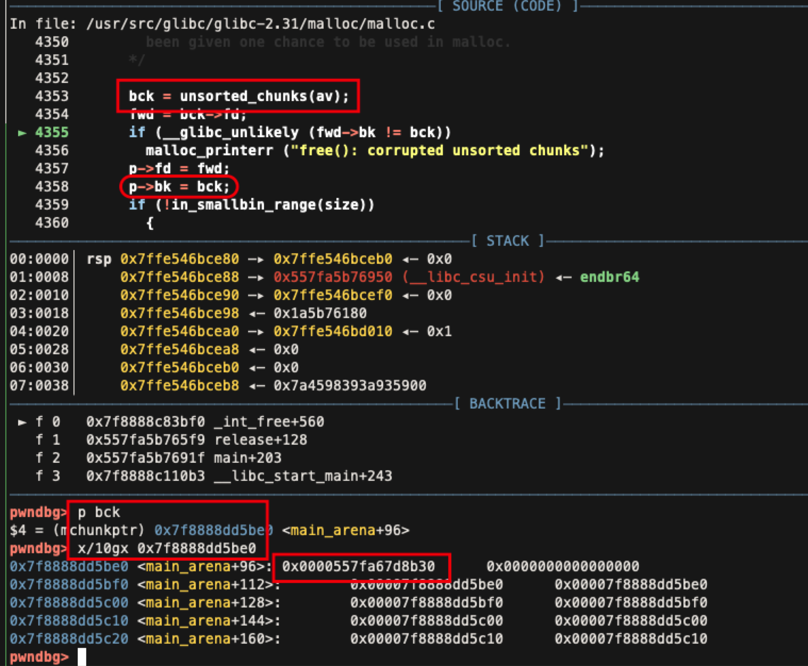

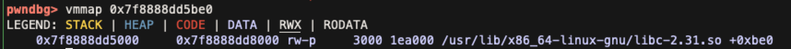

接下來透過 UAF 來 leak tcache 的 fd，進而拿到 heap address，首先先分配兩個 0x10 大小的 dummy。

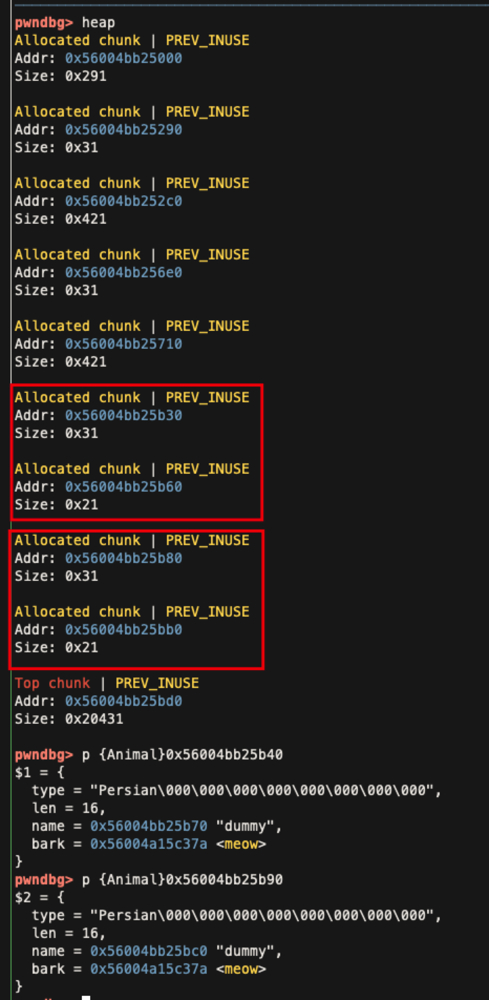

release 後這兩個 chunk 會落在 tcache 中，原本 idx 1 的 animal 的 type 會被指向前一個 chunk，由於使用 play 可以 print 出 `type`，藉此就可以 leak 出 heap address。

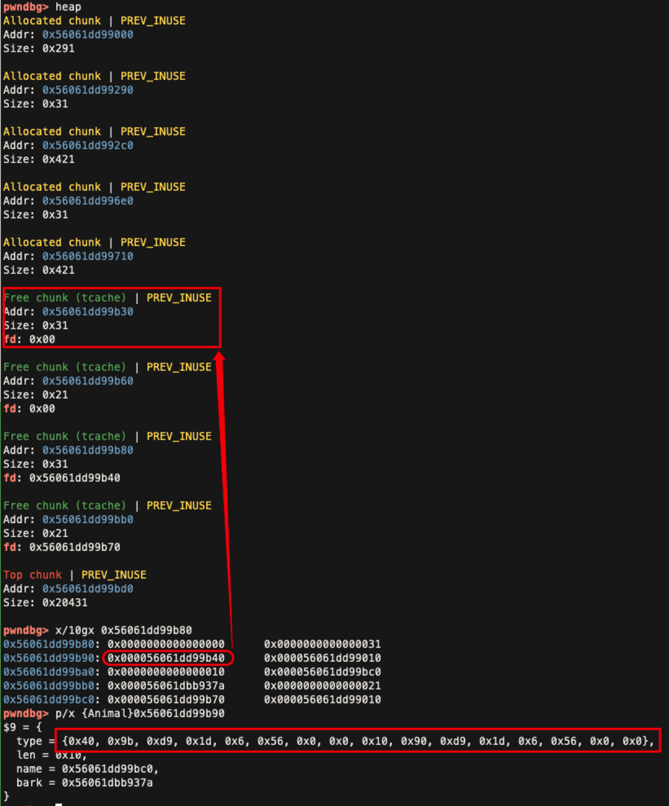

接下來 final.py 提供了三種解法：

第一種是透過 UAF 改寫 animal[0] 內的資料變成我們希望的 `system('/bin/sh')`，我們只需要使 animal[1] 的 name 的長度能要到 0x30 的 chunk，就可以拿到先前分配給 animal[0] 的 chunk，之後就可以構造 `type = '/bin/sh'`, `bark = system` ，即可 get shell。

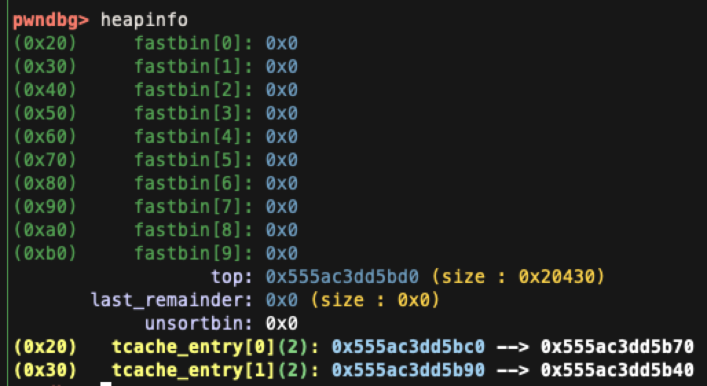

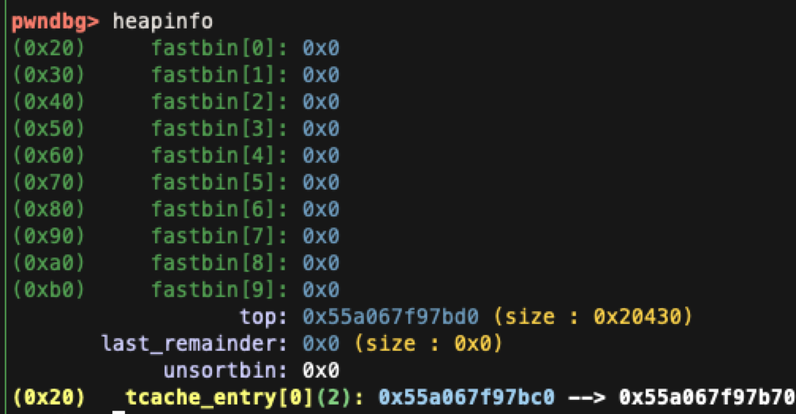

方法二原理與方法一相似，只是這次的目標是透過 `change` 來寫入任意 chunk，在構造 payload 時先將 name 設成我們想要寫入的位址，之後透過 `change` 寫入 one_gadget，即可在最後透過 `play` 呼叫。

方法三透過 tcache poisoning，因為攻擊比較複雜，我用投影片做了步驟的釐清，首先在第一步驟 leak libc 後 heap layout 會是：

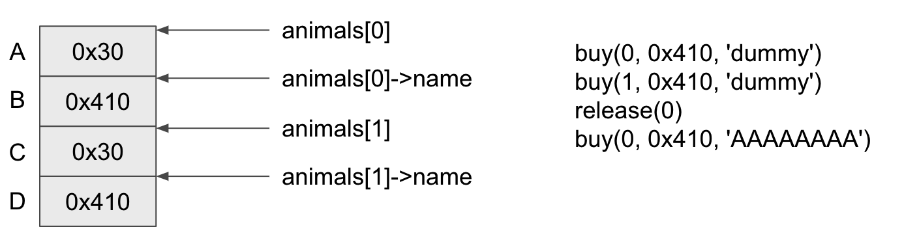

接著 leak tcache 後：

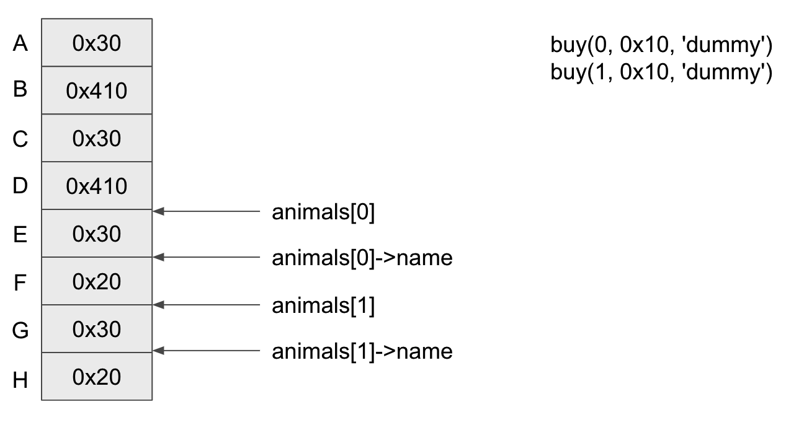

release 兩個 dummy，加入 tcache 中：

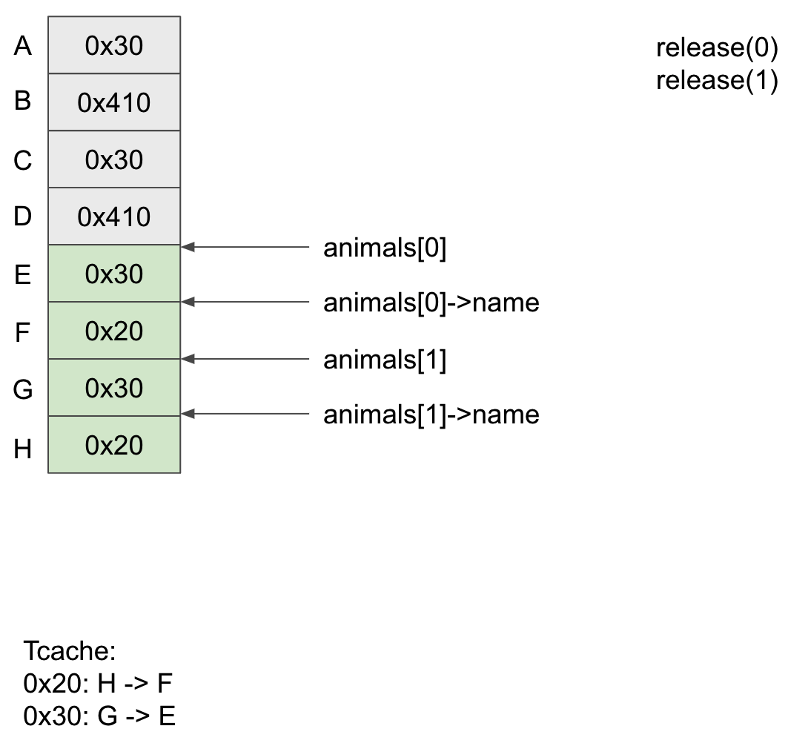

之後跟方法二的利用手法相同，把 `animals[0]->name` 指向待會 `animals[1]` 會指向的位址：

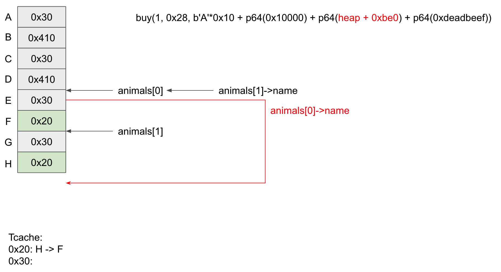

之後就可以透過寫入 `animals[0]->name` 來操作 `animals[1]` 內部的資料結構：

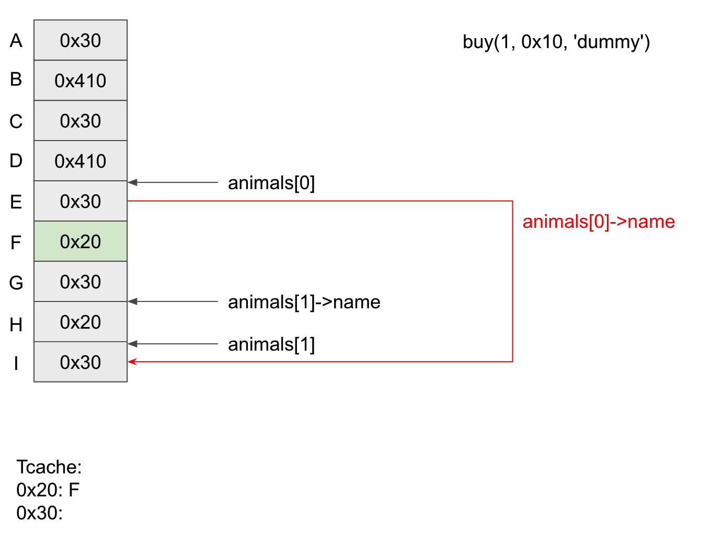

接著為了讓 0x30 的 tcache bin counter 數量變多一點，以便後續可以操作，需要做一些額外的 release：

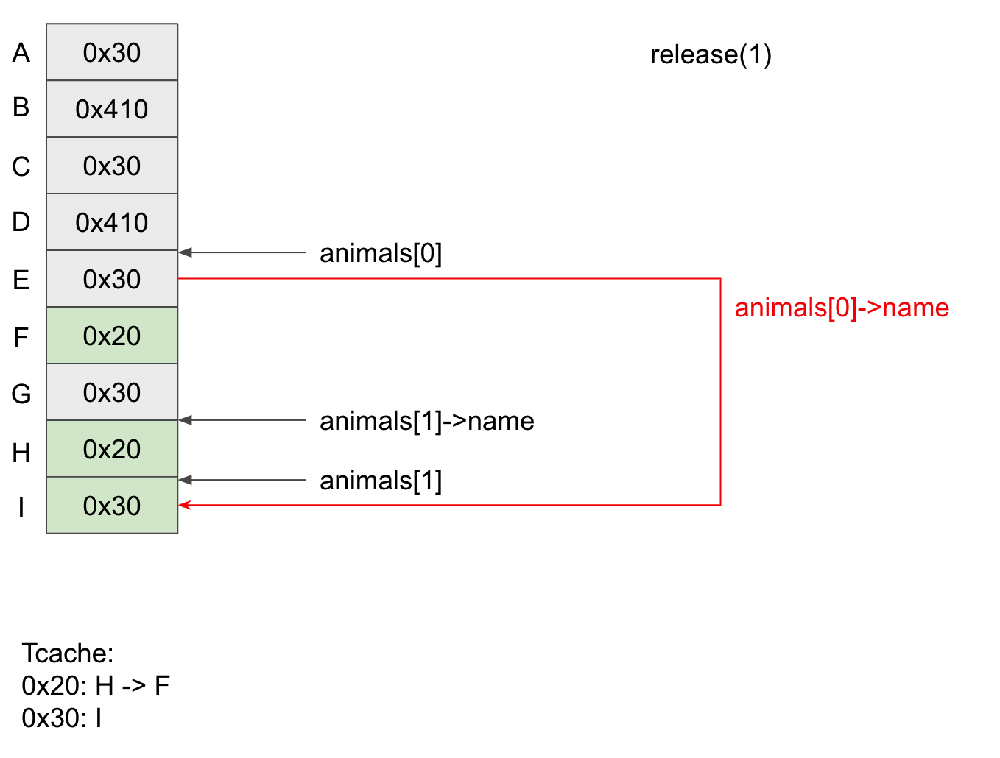

這邊需要注意因為 release 也會釋放 `name` 的記憶體，因此需要把它指向合法的 chunk 位址

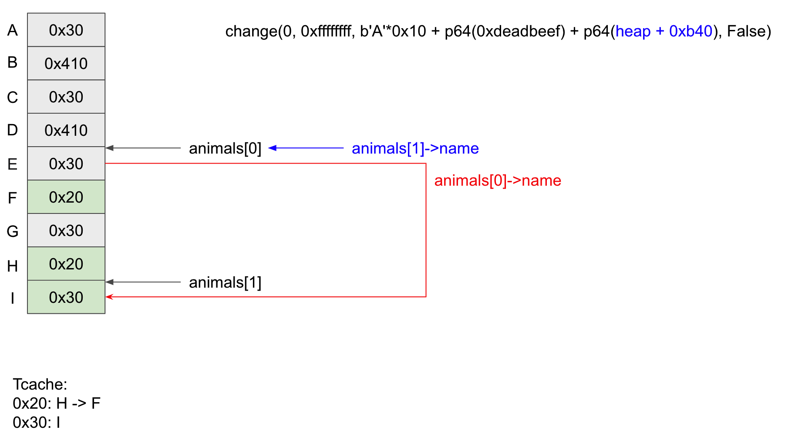

理論上到這步驟後 0x30 的 tcache bin 的 count 有 3，腳本的後續步驟其實可以省略：

```
    change(0, 0xffffffff, b'A'*0x10 + p64(0xdeadbeef) + p64(heap + 0xb90), False)
    release(1)
```

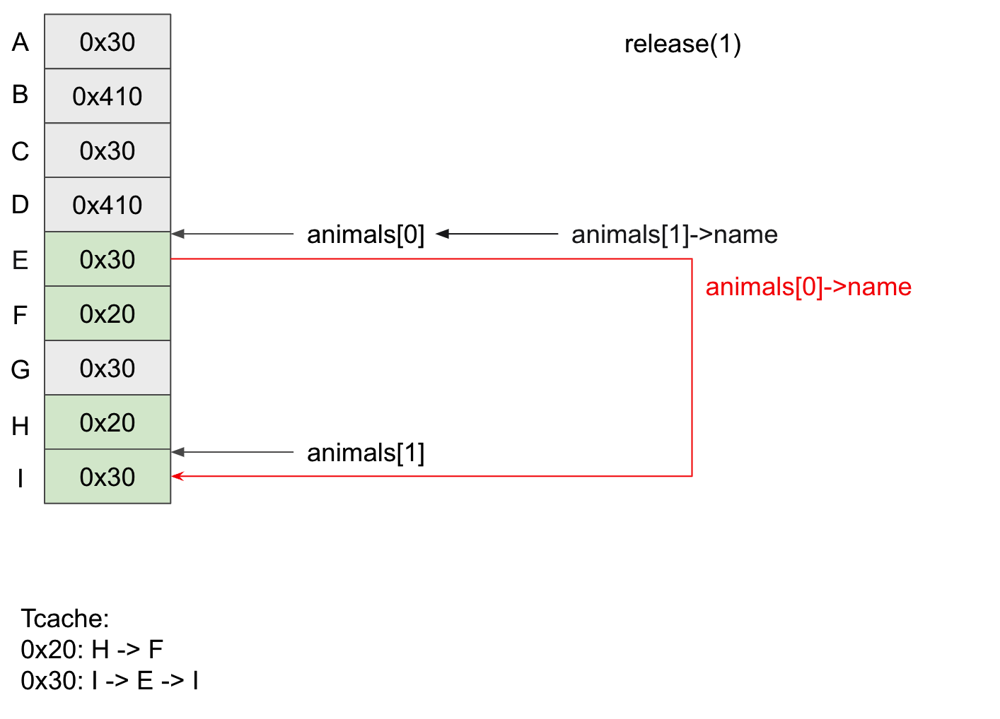

接著就可以做 tcahe poisoning，把 free_hook 的位址寫到 chunk 上：

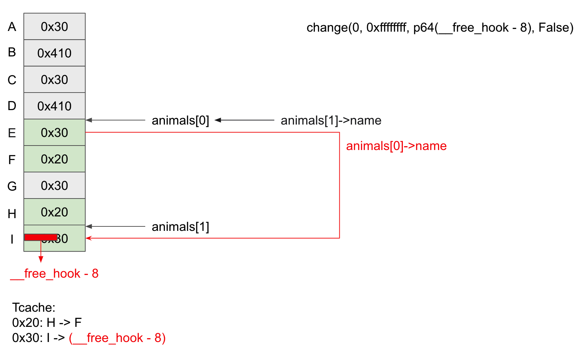

下一次要 0x30 的大小的記憶體時，就可以將 `name` 指向 `__free_hook - 8` 上，並且將 `/bin/sh` 寫到 `__free_hook - 8` 上，接著將 `system` 寫到 `__free_hook`：

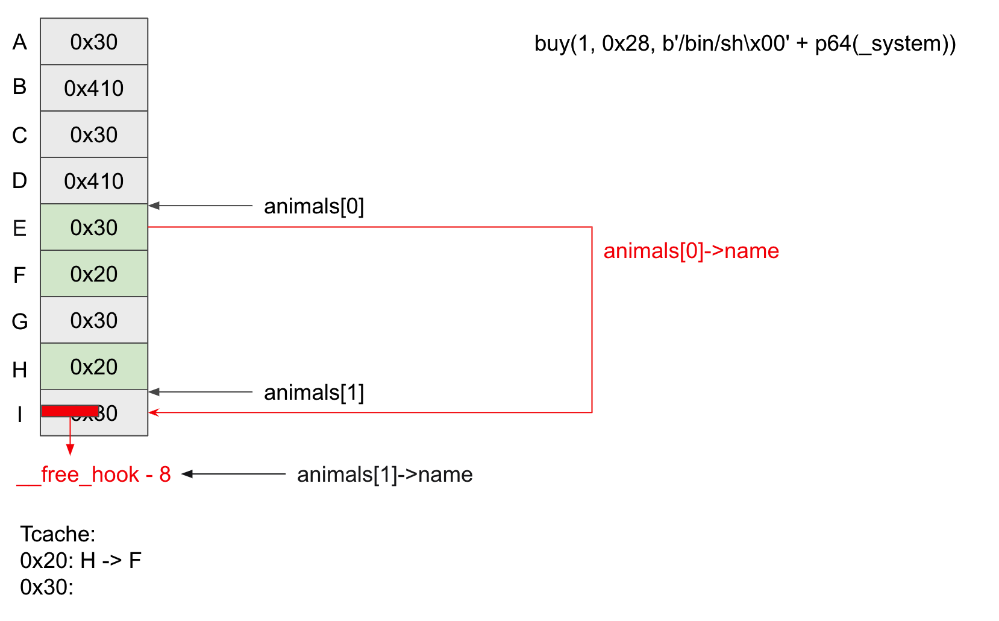

最後 release `animals[1]->name` 時，就會觸發 free_hook (system)，剛好 chunk 內容是 `/bin/sh`，就可以拿到 shell 了：

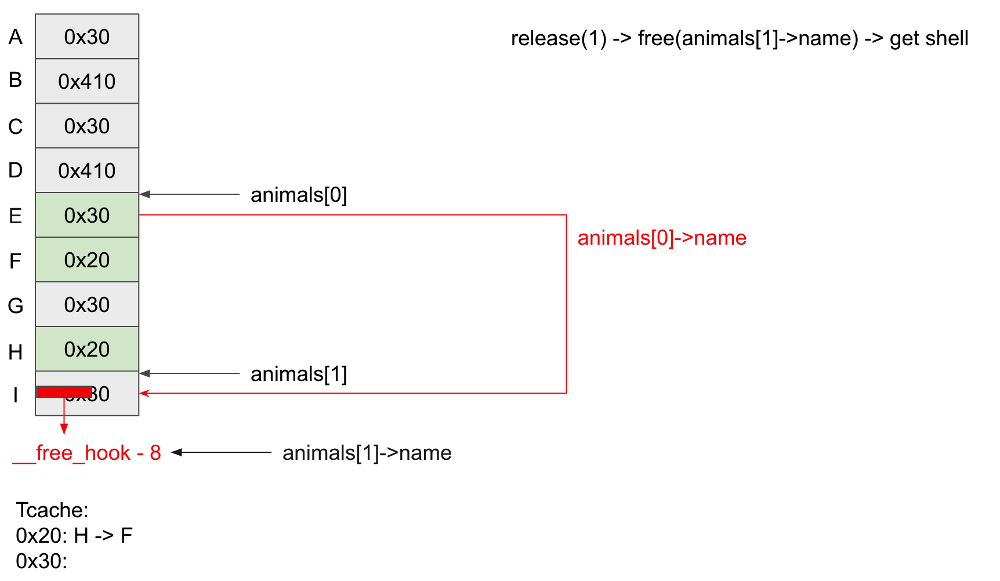
