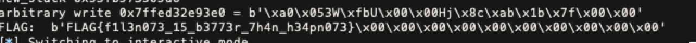

# FILE note

首先第一個要做的事就是 leak heap address，這邊的思路我是先 buffer overflow 一次，將 fileno 改成 1，接著執行一次 `save_note`，使 buffer 被初始化，接著再 overflow 一次，順便 partial overwrite `_IO_write_base` 的最後幾個 byte 來 leak 出東西。

這邊就踩到上課有說到的 local 過，remote 可能不過的問題，慢慢 debug 才發現用 remote 時一開始的 buf size 會是 4096，local 的 process 的 buf size 會是 1024，而且在 remote 的 write_end 會大於 write_ptr，會沒有辦法輸出什麼有用的東西。

接著就去 trace code，發現下面這段有用的 code，可以透過設定 `(_IO_LINE_BUF | _IO_UNBUFFERED)` 來將 write_end 跟 write_ptr 設為相同：

```c
int
_IO_new_file_overflow (FILE *f, int ch)
{
	...
      f->_flags |= _IO_CURRENTLY_PUTTING;
      if (f->_mode <= 0 && f->_flags & (_IO_LINE_BUF | _IO_UNBUFFERED))
	f->_IO_write_end = f->_IO_write_ptr;
    }
```

另一個問題就是因為會 overwrite `_IO_read_end` 的 address，因此需要走 `_IO_IS_APPENDING` 這條 path，所以也要將這個 flag 設起來：

```c
static size_t
new_do_write (FILE *fp, const char *data, size_t to_do)
{
  size_t count;
  if (fp->_flags & _IO_IS_APPENDING)
    /* On a system without a proper O_APPEND implementation,
       you would need to sys_seek(0, SEEK_END) here, but is
       not needed nor desirable for Unix- or Posix-like systems.
       Instead, just indicate that offset (before and after) is
       unpredictable. */
    fp->_offset = _IO_pos_BAD;
  else if (fp->_IO_read_end != fp->_IO_write_base)
    {
      off64_t new_pos
	= _IO_SYSSEEK (fp, fp->_IO_write_base - fp->_IO_read_end, 1);
      if (new_pos == _IO_pos_BAD)
	return 0;
      fp->_offset = new_pos;
    }
  count = _IO_SYSWRITE (fp, data, to_do);
  if (fp->_cur_column && count)
    fp->_cur_column = _IO_adjust_column (fp->_cur_column - 1, data, count) + 1;
  _IO_setg (fp, fp->_IO_buf_base, fp->_IO_buf_base, fp->_IO_buf_base);
  fp->_IO_write_base = fp->_IO_write_ptr = fp->_IO_buf_base;
  fp->_IO_write_end = (fp->_mode <= 0
		       && (fp->_flags & (_IO_LINE_BUF | _IO_UNBUFFERED))
		       ? fp->_IO_buf_base : fp->_IO_buf_end);
  return count;
}
```

這邊還有一個點是如果只 partial overwrite 最後一個 byte，可能也沒有辦法輸出什麼有用的東西，因此我 partial overwrite 了末兩個 byte，只是這樣就要讓 ASLR 隨機出來的 base address 最後兩個 byte 都是 0，之後再 parse heap 的資料，拿到 heap 的 base address。

拿到 heap 的 address 後，就可以構出一個任意讀來 leak 出 libc 的位址。

之後的部分我就卡關滿久的，原本想說用 one_gadget 來解，但是怎麼樣都沒辦法滿足條件。然後想到是不是可以用任意寫來 hijack fwrite 的 plt，但是後來發現是 full RELRO 所以這部分也沒辦法做利用。最後還是用了很麻煩的方法，首先要先 leak 出 stack 的位址，然後做 stack pivoting 到我們方便控制的 heap 位址上，之後再用 ROP chain 來 open, read, write，把 flag 輸出。

leak stack 的方式，我是用 libc 的 environ 拿到 stack 的 top address，但是因為真正有用的資料似乎還是會隨機化不是每次的 stack pointer 都會指到相同位址，這邊我用的方式是操作任意讀來將一大片的 stack 輸出並尋找 main stack 的位址，算出 offset 後就可以得到目前 stack pointer 的位址。

接著再操作任意寫來覆蓋掉 rbp 以及 return address 的位址，然後就可以將 stack 遷移到方便控制的位址上，最後構出 ROP chain 就可以拿到 flag 了。


