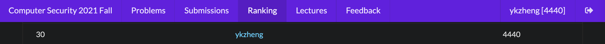

# 台大 計算機安全 (交大 程式安全) 2021 Fall

課程網站：https://edu-ctf.csie.org/

有開源的教材：

- Web: https://github.com/splitline/How-to-Hack-Websites
- Reverse: https://github.com/LJP-TW/NYCU-Secure-Programming
- Pwn: https://github.com/u1f383/Software-Security-2021

## 作業

除了 Web II 的 Profile Card 沒寫，其他都有寫完，總分為：`4440 / 4740`

作業分類：

| HW   | Type  | Points    |
| ---- | ----- | --------- |
| 0x00 | `All` | 50 / each |

Crypto: `1000/1000`

| HW                 | Type                                 | Points |
| ------------------ | ------------------------------------ | ------ |
| [Lab] Grams        | `Vigenere Cipher`, `N-Grams Attacks` | 50     |
| [Lab] Geffe        | `LFSR`, `Correlation Attacks`        | 50     |
| [Lab] POA          | `Padding Oracle Attack`              | 50     |
| [0x01] nLFSR       | `LFSR`                               | 150    |
| [Lab] LSB          | `LSB Oracle`                         | 50     |
| [Lab] Pohel        | `Pohlig-Hellman Algorithm`           | 50     |
| [0x01] Single      | `Elliptic Curve (Singular)`          | 200    |
| [Lab] HNP          | `ECDSA`                              | 50     |
| [Lab] LEA          | `Length Extension Attack`            | 50     |
| [Lab] LAT          | `Gaussian Lattice Reduction`         | 50     |
| [0x01] HNP-revenge | `LLL`                                | 250    |

Web: `1000/1300`

| HW                           | Type                                               | Points |
| ---------------------------- | -------------------------------------------------- | ------ |
| [Lab] Cat Shop               | `Basic`                                            | 10     |
| [Lab] 喵 site                | `Basic LFI`                                        | 10     |
| [Lab] Hakka MD               | `LFI`, `RCE`                                       | 20     |
| [Lab] DNS Lookup Tool        | `Command injection`                                | 10     |
| [Lab] DNS Lookup Tool - WAF  | `Command injection`, `WAF`                         | 20     |
| [Lab] Log me in              | `SQL injection`                                    | 20     |
| [0x02] Imgura                | `Information Leak`, `Upload`, `LFI`                | 150    |
| [0x02] DVD Screensaver       | `Path traversal`, `SQL injection`, `Signed Cookie` | 250    |
| [Lab] Log me in: Revenge     | `UNION-based SQL injection`                        | 20     |
| [Lab] Preview Card           | `SSRF`, `gopher://`                                | 20     |
| [Lab] SSRFrog                | `SSRF`, `Bypass blacklist`                         | 20     |
| [Lab] Pickle                 | `Deserialization`, `pickle`                        | 20     |
| [0x02] Profile Card          | `XSS`, `CSRF`, `CSP Bypass`                        | 300    |
| [Lab] Serializable Cat       | `Deserialization`, `Basic PHP unserialize`         | 20     |
| [Lab] Serializable Magic Cat | `Deserialization`, `POP chain`                     | 20     |
| [Lab] XSS Me                 | `Frontend`                                         | 20     |
| [Lab] Jinja SSTI             | `SSTI`                                             | 20     |
| [0x02] Double SSTI           | `SSTI`                                             | 150    |
| [0x02] Log me in: FINAL      | `SQL injection`, `Information Leak`                | 200    |

Reverse: `1000/1000`

| HW                        | Type                          | Points |
| ------------------------- | ----------------------------- | ------ |
| [Lab] baby                | `Basic`                       | 20     |
| [Lab] list                | `Basic`                       | 20     |
| [Lab] main1               | `Where to start`              | 20     |
| [Lab] main2               | `Where to start`              | 20     |
| [Lab] main3               | `Where to start`              | 20     |
| [Lab] main4               | `Where to start`              | 20     |
| [0x03] fifo               | `FIFO`, `Fork`                | 250    |
| [Lab] HelloWindows        | `VirtualProtect`              | 20     |
| [Lab] Cpp_Traditional_GUI | `MessageBox`                  | 20     |
| [Lab] dll                 | `dll`                         | 20     |
| [0x03] giveUflag          | `dll`                         | 250    |
| [Lab] HellWindows         | `TLS Callback`                | 20     |
| [Lab] 3xc3pt              | `Exception Handler`           | 20     |
| [0x03] nani               | `Packer`, `Exception Handler` | 280    |

Pwn: `1240/1240`

| HW                    | Type                   | Points |
| --------------------- | ---------------------- | ------ |
| [Lab] Got2win         | `GOT`                  | 20     |
| [Lab] Rop2win         | `ROP`                  | 20     |
| [0x04] sandbox        | `Shell code`           | 100    |
| [0x04] fullchain      | `fmt`, `GOT`, `ROP`    | 150    |
| [0x04] fullchain-nerf | `fmt`, `GOT`, `ROP`    | 100    |
| [Lab] heapmath        | `Heap`                 | 20     |
| [Lab] market          | `Heap`                 | 20     |
| [0x04] final          | `Heap`                 | 50     |
| [0x04] easyheap       | `Heap`                 | 150    |
| [0x04] beeftalk       | `Heap`                 | 150    |
| [Lab] FILE note - (R) | `Glibc File Structure` | 20     |
| [Lab] FILE note - (W) | `Glibc File Structure` | 20     |
| [Lab] FILE note - (X) | `Glibc File Structure` | 20     |
| [0x04] FILE note      | `Glibc File Structure` | 300    |
| [Lab] OvO8            | `Browser Exploitation` | 100    |

各項佔總成績為：

| HW              | Grade |
| --------------- | ----- |
| HW0 (5%)        | 97.5  |
| HW1 (15%)       | 100   |
| HW2 (15%)       | 92.5  |
| HW3 (15%)       | 92.5  |
| HW4 (15%)       | 100   |
| 課外參與 (10%)  | 90    |
| Final CTF (25%) | 83.21 |

writeup 以及 exploit 參閱各作業的資料夾。
