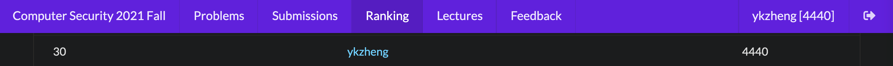

# 台大 計算機安全 (交大 程式安全) 2021 Fall

課程網站：https://edu-ctf.csie.org/

有開源的教材：

- Web: https://github.com/splitline/How-to-Hack-Websites
- Reverse: https://github.com/LJP-TW/NYCU-Secure-Programming
- Pwn: https://github.com/u1f383/Software-Security-2021

## 作業

除了 Web II 的 Profile Card 沒寫，其他都有寫完，總分為：`4440 / 4740`



作業分類：

| HW   | Type  | Points    |
| ---- | ----- | --------- |
| 0x00 | `All` | 50 / each |

Crypto: `1000/1000`

| HW                                                                 | Type                                 | Points |
| ------------------------------------------------------------------ | ------------------------------------ | ------ |
| [[Lab] Grams](Crypto/Crypto%20I/%5BLab%5D%20Grams)                 | `Vigenere Cipher`, `N-Grams Attacks` | 50     |
| [[Lab] Geffe](Crypto/Crypto%20I/%5BLab%5D%20Geffe)                 | `LFSR`, `Correlation Attacks`        | 50     |
| [[Lab] POA](Crypto/Crypto%20I/%5BLab%5D%20POA)                     | `Padding Oracle Attack`              | 50     |
| [[0x01] nLFSR](Crypto/Crypto%20I/%5B0x01%5D%20nLFSR)               | `LFSR`                               | 150    |
| [[Lab] LSB](Crypto/Crypto%20II/%5BLab%5D%20LSB)                    | `LSB Oracle`                         | 50     |
| [[Lab] Pohel](Crypto/Crypto%20II/%5BLab%5D%20Pohel)                | `Pohlig-Hellman Algorithm`           | 50     |
| [[0x01] Single](Crypto/Crypto%20II/%5B0x01%5D%20Single)            | `Elliptic Curve (Singular)`          | 200    |
| [[Lab] HNP](Crypto/Crypto%20III/%5BLab%5D%20HNP)                   | `ECDSA`                              | 50     |
| [[Lab] LEA](Crypto/Crypto%20III/%5BLab%5D%20LEA)                   | `Length Extension Attack`            | 50     |
| [[Lab] LAT](Crypto/Crypto%20III/%5BLab%5D%20LAT)                   | `Gaussian Lattice Reduction`         | 50     |
| [[0x01] HNP-revenge](Crypto/Crypto%20III/%5B0x01%5D%20HNP-revenge) | `LLL`                                | 250    |

Web: `1000/1300`

| HW                                                                                   | Type                                               | Points |
| ------------------------------------------------------------------------------------ | -------------------------------------------------- | ------ |
| [[Lab] Cat Shop](Web/Web%20I/%5BLab%5D%20Cat%20Shop)                                 | `Basic`                                            | 10     |
| [[Lab] 喵 site](Web/Web%20I/%5BLab%5D%20喵%20site)                                   | `Basic LFI`                                        | 10     |
| [[Lab] Hakka MD](Web/Web%20I/%5BLab%5D%20Hakka%20MD)                                 | `LFI`, `RCE`                                       | 20     |
| [[Lab] DNS Lookup Tool](Web/Web%20I/%5BLab%5D%20DNS%20Lookup%20Tool)                 | `Command injection`                                | 10     |
| [[Lab] DNS Lookup Tool - WAF](Web/Web%20I/%5BLab%5D%20DNS%20Lookup%20Tool%20-%20WAF) | `Command injection`, `WAF`                         | 20     |
| [[Lab] Log me in](Web/Web%20I/%5BLab%5D%20Log%20me%20in)                             | `SQL injection`                                    | 20     |
| [[0x02] Imgura](Web/Web%20I/%5B0x02%5D%20Imgura)                                     | `Information Leak`, `Upload`, `LFI`                | 150    |
| [[0x02] DVD Screensaver](Web/Web%20I/%5B0x02%5D%20DVD%20Screensaver)                 | `Path traversal`, `SQL injection`, `Signed Cookie` | 250    |
| [[Lab] Log me in: Revenge](Web/Web%20II/%5BLab%5D%20Log%20me%20in%20Revenge)         | `UNION-based SQL injection`                        | 20     |
| [[Lab] Preview Card](Web/Web%20II/%5BLab%5D%20Preview%20Card)                        | `SSRF`, `gopher://`                                | 20     |
| [[Lab] SSRFrog](Web/Web%20II/%5BLab%5D%20SSRFrog)                                    | `SSRF`, `Bypass blacklist`                         | 20     |
| [[Lab] Pickle](Web/Web%20III/%5BLab%5D%20Pickle)                                     | `Deserialization`, `pickle`                        | 20     |
| [0x02] Profile Card                                                                  | `XSS`, `CSRF`, `CSP Bypass`                        | 300    |
| [[Lab] Serializable Cat](Web/Web%20III/%5BLab%5D%20Serializable%20Cat)               | `Deserialization`, `Basic PHP unserialize`         | 20     |
| [[Lab] Serializable Magic Cat](Web/Web%20III/%5BLab%5D%20Serializable%20Magic%20Cat) | `Deserialization`, `POP chain`                     | 20     |
| [[Lab] XSS Me](Web/Web%20III/%5BLab%5D%20XSS%20Me)                                   | `Frontend`                                         | 20     |
| [[Lab] Jinja SSTI](Web/Web%20III/%5BLab%5D%20Jinja%20SSTI)                           | `SSTI`                                             | 20     |
| [[0x02] Double SSTI](Web/Web%20III/%5B0x02%5D%20Double%20SSTI)                       | `SSTI`                                             | 150    |
| [[0x02] Log me in: FINAL](Web/Web%20III/%5B0x02%5D%20Log%20me%20in%20FINAL)          | `SQL injection`, `Information Leak`                | 200    |

Reverse: `1000/1000`

| HW                                                                                | Type                          | Points |
| --------------------------------------------------------------------------------- | ----------------------------- | ------ |
| [[Lab] baby](Reverse/Reverse%20I/%5BLab%5D%20baby)                                | `Basic`                       | 20     |
| [[Lab] list](Reverse/Reverse%20I/%5BLab%5D%20list)                                | `Basic`                       | 20     |
| [[Lab] main1](Reverse/Reverse%20I/%5BLab%5D%20main1)                              | `Where to start`              | 20     |
| [[Lab] main2](Reverse/Reverse%20I/%5BLab%5D%20main2)                              | `Where to start`              | 20     |
| [[Lab] main3](Reverse/Reverse%20I/%5BLab%5D%20main3)                              | `Where to start`              | 20     |
| [[Lab] main4](Reverse/Reverse%20I/%5BLab%5D%20main4)                              | `Where to start`              | 20     |
| [[0x03] fifo](Reverse/Reverse%20I/%5B0x03%5D%20fifo)                              | `FIFO`, `Fork`                | 250    |
| [[Lab] HelloWindows](Reverse/Reverse%20II/%5BLab%5D%20HelloWindows)               | `VirtualProtect`              | 20     |
| [[Lab] Cpp_Traditional_GUI](Reverse/Reverse%20II/%5BLab%5D%20Cpp_Traditional_GUI) | `MessageBox`                  | 20     |
| [[Lab] dll](Reverse/Reverse%20II/%5BLab%5D%20dll)                                 | `dll`                         | 20     |
| [[0x03] giveUflag](Reverse/Reverse%20II/%5B0x03%5D%20giveUflag)                   | `dll`                         | 250    |
| [[Lab] HellWindows](Reverse/Reverse%20III/%5BLab%5D%20HellWindows)                | `TLS Callback`                | 20     |
| [[Lab] 3xc3pt](Reverse/Reverse%20III/%5BLab%5D%203xc3pt)                          | `Exception Handler`           | 20     |
| [[0x03] nani](Reverse/Reverse%20III/%5B0x03%5D%20nani)                            | `Packer`, `Exception Handler` | 280    |

Pwn: `1240/1240`

| HW                                                                         | Type                   | Points |
| -------------------------------------------------------------------------- | ---------------------- | ------ |
| [[Lab] Got2win](Pwn/Pwn%20I/%5BLab%5D%20Got2win)                           | `GOT`                  | 20     |
| [[Lab] Rop2win](Pwn/Pwn%20I/%5BLab%5D%20Rop2win)                           | `ROP`                  | 20     |
| [[0x04] sandbox](Pwn/Pwn%20I/%5B0x04%5D%20sandbox)                         | `Shell code`           | 100    |
| [[0x04] fullchain](Pwn/Pwn%20I/%5B0x04%5D%20fullchain)                     | `fmt`, `GOT`, `ROP`    | 150    |
| [[0x04] fullchain-nerf](Pwn/Pwn%20I/%5B0x04%5D%20fullchain-nerf)           | `fmt`, `GOT`, `ROP`    | 100    |
| [Lab] heapmath                                                             | `Basic Heap`           | 20     |
| [[Lab] market](Pwn/Pwn%20II/%5BLab%5D%20market)                            | `Heap`                 | 20     |
| [[0x04] final](Pwn/Pwn%20II/%5B0x04%5D%20final)                            | `Heap`                 | 50     |
| [[0x04] easyheap](Pwn/Pwn%20II/%5B0x04%5D%20easyheap)                      | `Heap`                 | 150    |
| [[0x04] beeftalk](Pwn/Pwn%20II/%5B0x04%5D%20beeftalk)                      | `Heap`                 | 150    |
| [[Lab] FILE note - (R)](<Pwn/Pwn%20III/%5BLab%5D%20FILE%20note%20-%20(R)>) | `Glibc File Structure` | 20     |
| [[Lab] FILE note - (W)](<Pwn/Pwn%20III/%5BLab%5D%20FILE%20note%20-%20(W)>) | `Glibc File Structure` | 20     |
| [[Lab] FILE note - (X)](<Pwn/Pwn%20III/%5BLab%5D%20FILE%20note%20-%20(X)>) | `Glibc File Structure` | 20     |
| [[0x04] FILE note](Pwn/Pwn%20III/%5B0x04%5D%20FILE%20note)                 | `Glibc File Structure` | 300    |
| [[Lab] OvO8](Pwn/Pwn%20III/%5BLab%5D%20OvO8)                               | `Browser Exploitation` | 100    |

各項佔總成績為：

| HW              | Grade |
| --------------- | ----- |
| HW0 (5%)        | 97.5  |
| HW1 (15%)       | 100   |
| HW2 (15%)       | 92.5  |
| HW3 (15%)       | 92.5  |
| HW4 (15%)       | 100   |
| 課外參與 (10%)  | 90    |
| [Final CTF](Final/) (25%) | 83.21 |

writeup 以及 exploit 參閱各作業的資料夾。

## 環境

```
./snippet build
./snippet up
./snippet shell
./snippet down
```
