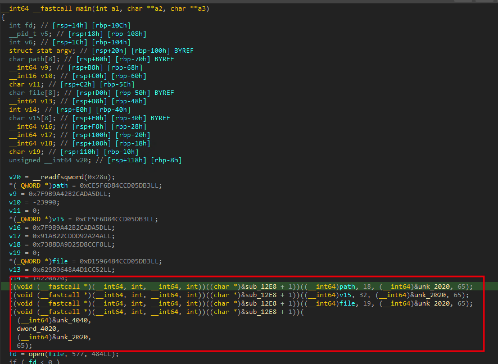
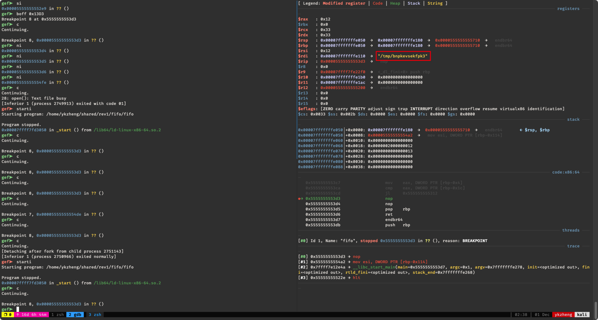
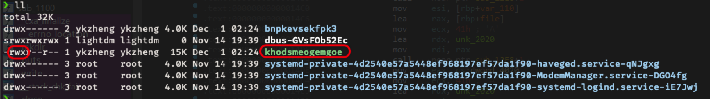
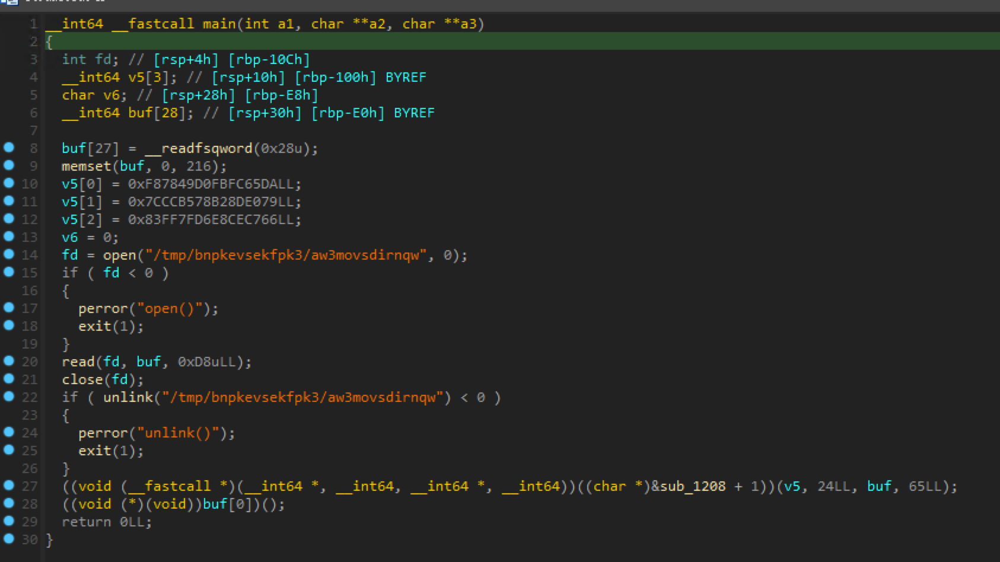
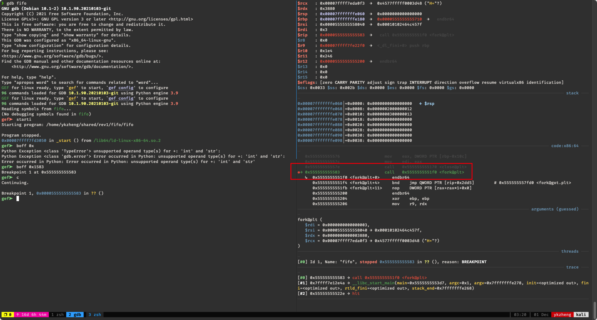
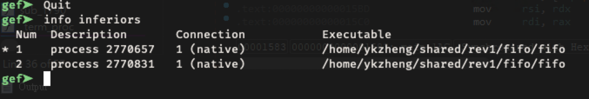
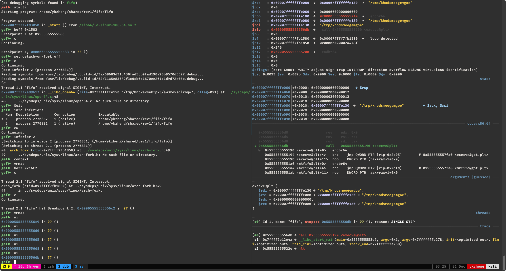
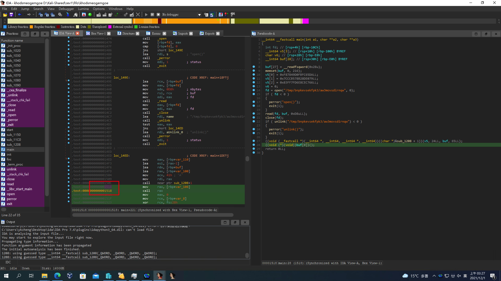
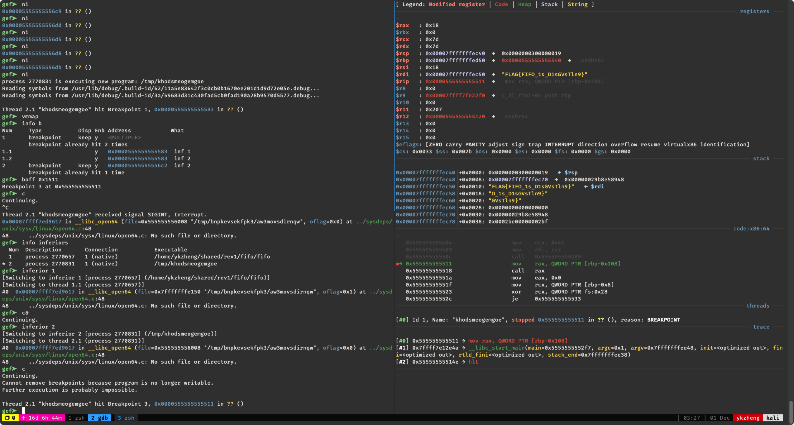

# fifo

decompile 後觀察 main 字串處理，可以發現 `sub_12E8` 被 call 了四次，可以透過設斷點來取得一些變數的資訊：

在 gdb 執行並設斷點後，依序取得檔案資訊 `path=/tmp/bnpkevsekfpk3`, `v15=/tmp/bnpkevsekfpk3/aw3movsdirnqw`, `file=/tmp/khodsmeogemgoe`, 

接著再看下面程式的邏輯，應該是寫了一個檔案在 `/tmp/khodsmeogemgoe`，然後再 fork + exec 執行這個檔案，去 /tmp 下可以看到有一個執行檔。接著 parent process 會打開一個 fifo 檔案 `/tmp/bnpkevsekfpk3/aw3movsdirnqw` 然後對這個檔案寫入一串字串後結束執行。可以大概猜到這個字串就是 FLAG。

把 `/tmp/khodsmeogemgoe` 丟到 IDA decompile 後，可以發現他會打開一個 fifo 的檔案然後去接 parent process 傳來的字串，然後做一些神秘的處理 (`sub_1208`)

我的策略就是使用 gdb 在 fork 的時候先去執行 parent process，讓 child process 停下來，確保 fifo file 有先被打開，之後再進到 child process 去接字串。

這邊學到的點就是 gdb 有 `set detach-on-fork off` 還有 `info inferiors` 以及 `inferior xxx` 可以方便 debug multiple process 的情況。

首先先讓程式執行到 fork 這行停下來，接著用 `ni` 讓 child process 停在 fork 內第一行指令，parent process 會繼續執行。

用 `info inferiors` 看到目前 child process 還是 fifo 不是 `/tmp/khodsmeogemgoe`

接著 parent process 用 `c&` 在背景執行，使用 `inferier 2` 切換到 child process，直到 exec 進到 `/tmp/khodsmeogemgoe`

接著在 child process 內下 breakpoint 到最後一行

繼續執行就會發現 flag 出現在 `$rdi` 了。

