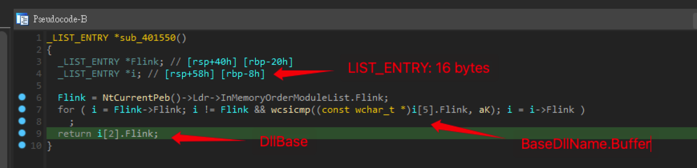

# giveUflag

首先把 exe 丟到 IDA 去看 main，decompile 後看看他 call 的 function

看到 `sub_401550` 很可疑，基本上就是在找 k 開頭的 dllname（ `kernelbase.dll` 或是 `kernel32.dll`)，這邊是拿 `InMemoryOrderModuleList.Flink` 往上加 offset 後做字串比對，找到之後 return dllbase

拿到 dllbase 的 function pointer 後，就是找裡面的函式，這邊看到是找 `sleep` 這個 function，發現 `v5` 其實就是在 call sleep，所以策略就是用 x64dbg 把進入斷點前的 `rcx` 設成 0，也就是 bypass sleep。

接著就是操作 x64dbg 就可以拿到 flag 了。

