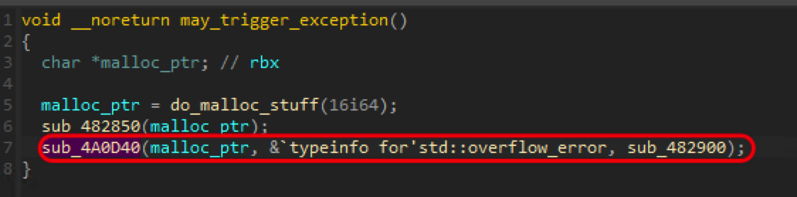

# nani

首先丟到 DIE 去看會發現 nani.exe 有被 UPX 包過一遍

於是就把它解開然後再丟到 IDA 和 x64dbg

跑了一下程式發現會有 `You use debugger ... bad reverse engine` 的輸出，就跑去 IDA 用 symbol 找了一下 cross reference 可以找到檢查 debugger 的 function

把這段 code reverse 了一下，會發現中間有一段用來 anti-disassembly 的 code，然後再往下追會發現檢查 vm 的一個 function

把 check_vm 裡面的 code reverse 一下，會發現 if 內有一個很可疑的 function 好像跟 exception 有關，所以我的策略就是把 v11 設成 0，就可以觸發 exception，然後就會執行 exception handler。

把 `may_trigger_exception` 打開後可以看到 IDA 發現了一個 unwind，這邊我把它叫做 `mysterious` 

把 `mysterious` decompile 後，可以看到他很神秘的在幫 `byte_4015AF` 做 xor 之類的事情，直覺覺得這邊會有事，所以就用 x64dbg 往這邊看。

將前面提到的 v11 設成 0 後

繼續執行可以發現他會進去執行 `mysterious` 

這邊想要看 `byte_4015AF` 裡面到底是什麼東西，所以去看 `lea rdx` 出來後的值是 `4015AF`

接著 x64dbg 跳到 `4015AF` 可以看到這段程式把原本 IDA 解出來是 data 的部分還原回 code 了

這邊我直接把 RIP 改成 `4015AF` 下去繼續執行，就可以拿到 FLAG 了

P.S 一開始以為會跟 SEH 還有 exception handler 有關，有翻到 `TlsCallback` 在註冊 exception handler 還有 `Handler` 這個 function，但好像沒發現裡面有什麼有用的資訊。解完也拿這題測試了一下 SEH，發現執行順序是 `may_trigger_exception` -> `sub_4A0D40`(觸發 exception) -> SEH -> `Handler` -> `mysterious` ，的確跟我直覺想的一樣，只是還是不太確定 `mysterious` 是什麼時候註冊成 exception handler 的就是了。
