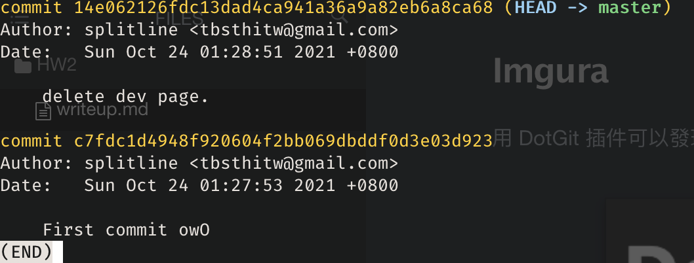
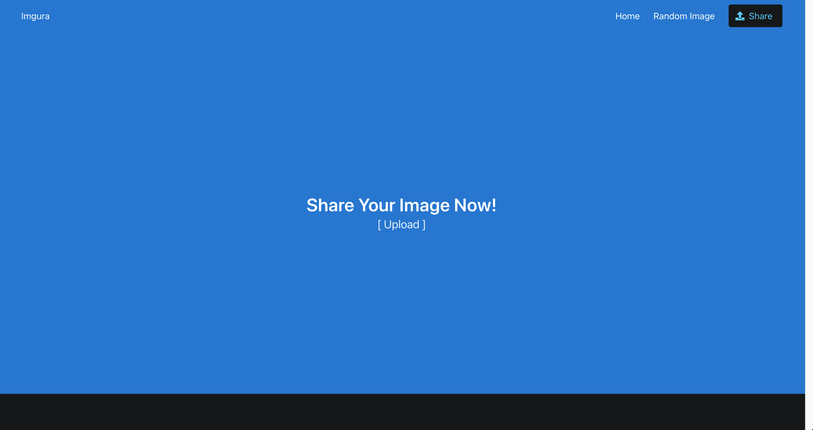
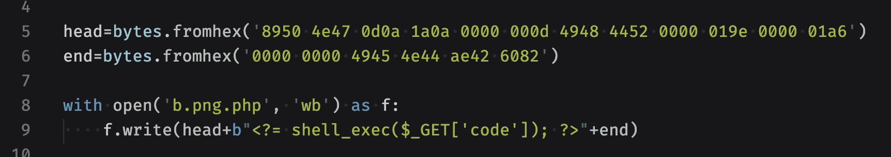

# Imgura

用 DotGit 插件可以發現這個網站有 leak 出 .git

把 git 下載下來後觀察 git log 會發現有更多資訊保留在第一個 commit

於是就使用 `git checkout c7fdc1d4948f920604f2bb069dbddf0d3e03d923` 到第一個 commit 後就可以看到 `dev_test_page` 這個資料夾。

到 `https://imgura.chal.h4ck3r.quest/dev_test_page/` 這個網址後就會看到隱藏的頁面：

點擊右上角的 share 可以上傳檔案上去，主要要研究的檔案就是 `dev_test_page/upload.php`：

第一個要 bypass 的是 extension check，可以發現這邊只會拿 [1]，所以我把檔名叫做 `b.png.php`，就能夠通過這個測試

接著要 bypass 的是 MIME type check 以及 width/height check：

去 [wiki](https://en.wikipedia.org/wiki/Portable_Network_Graphics) 研究了一下 png 的 header 格式，再交叉比對一下自己電腦裡面的 png binary format，我用了下面這個 head 以及 end 加在原先要上傳上去的文字檔，就可以通過這個檢查

最後就是檢查有沒有 `<?php` tag，去看了一下 [manual](https://www.php.net/manual/en/language.basic-syntax.phptags.php)：

> 2. You can use the short echo tag to `<?= 'print this string' ?>`.
>    It's equivalent to `<?php echo 'print this string' ?>`.

我就使用 `<?=` 來代替 `<?php`，就可以通過這個檢查：

檔案上傳成功後就可以開始操作 RCE，在 url 的 query 加上 `code=ls%20/` (https://imgura.chal.h4ck3r.quest/dev_test_page/images/11943822_b.png.php?code=ls%20/)

最後再 `code=cat%20/this_is_flaggggg` ，就可以拿到 flag 了

