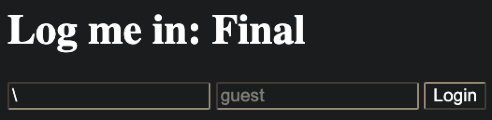
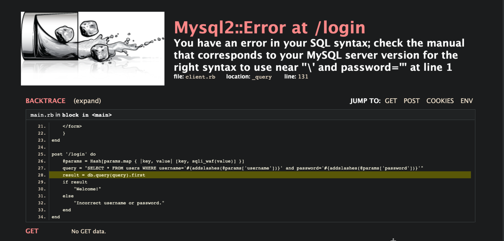
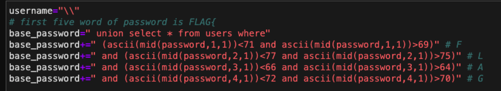
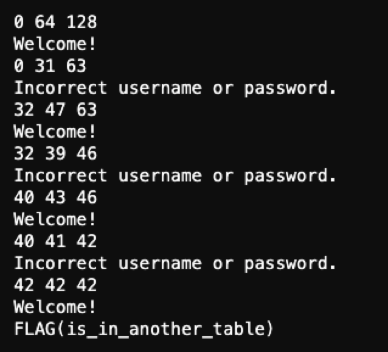
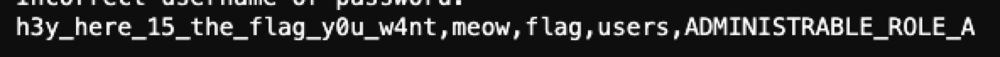
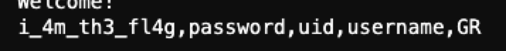
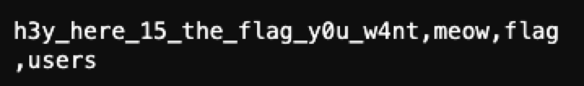
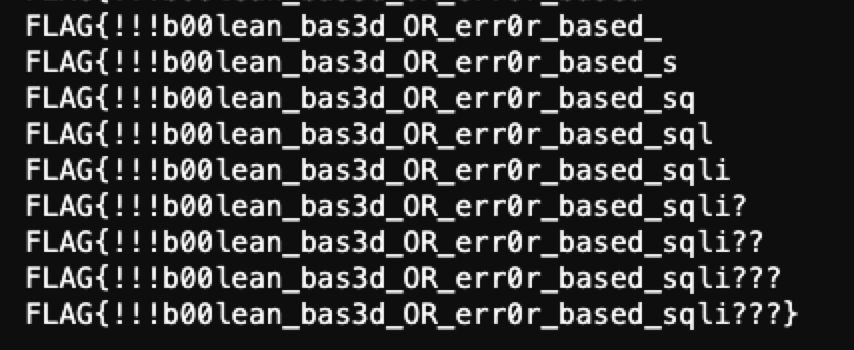

# Log me in: Final

一開始要先想辦法讓他變出 500，試了一下發現 `\` 這個就可以了：





然後就可以拿到 sql 語句是：`SELECT * FROM users WHERE username='#{addslashes(@params['username'])}' and password='#{addslashes(@params['password'])}'`

構造 sql injection，首先先把 username 設成 `\` escape 掉第一個 `'`，會被後面 password 的第一個 `'` 給閉合，策略是構造出以下 sql command：

```
SELECT * FROM users WHERE username='\' and password=' UNION SELECT * FROM users#'
```

結果會跳出 error 頁面，可以發現` UNION SELECT * FROM users#` 會被取代成 `*FROMusers#`，代表空白以及 `UNION`, `SELECT` 關鍵字會被 WAF 處理掉。我使用的 bypass 技巧是把空白變成 `/**/`，把 `UNION` 變成 `UNIUNIONON`，把 `SELECT` 變成 `SELSELECTECT`，這樣 WAF 就會把中間的 `UNION` 以及 `SELECT` 取代掉，就可以達到我們想要做成的 payload。

最後得到以下語句：

```
SELECT * FROM users WHERE username='\' and password='/**/UNIUNIONON/**/SELSELECTECT/**/*/**/FROM/**/users#'
```

接下來就進行 Boolean-Based Blind SQL injection 來找出 FLAG，首先先限定 FLAG 開頭的 password，然後一個字一個字用 binary search 破出 FLAG。



但是寫到這裡發現破出來的 FLAG 說真正的 FLAG 在其他 table...



繼續用 Boolean-Based Blind SQL injection 來找出 table_name，這邊 password 的 payload 為，細節可以看 script：

```
 union select 1,2,3 where (ascii(mid((select group_concat(table_name) from information_schema.tables),{pos},1))<{i})
```

用 binary serach 去找 table_name，可以找到 `h3y_here_15_the_flag_y0u_w4nt` 這張表：



接著用相同手段只是改成去找 `information_schema.columns` 可以破出這個表的欄位 `i_4m_th3_fl4g`：



然後我就用前面最一開始的方式破 `h3y_here_15_the_flag_y0u_w4nt` 裡面 `i_4m_th3_fl4g` field 的 FLAG，然後發現怎麼樣都找不到 `h3y_here_15_the_flag_y0u_w4nt` 這張表。卡了一陣子後猜發現那張表的名字其實是 `h3y_here_15_the_flag_y0u_w4nt,meow,flag`...



最後再用相同方式去找那張表，就可以拿到 FLAG 了。


